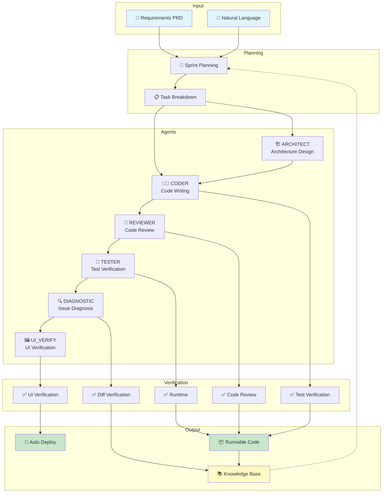
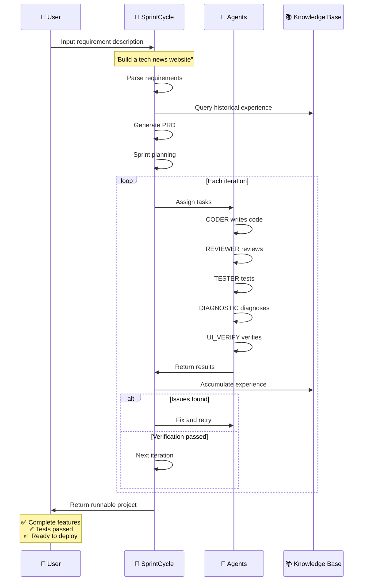
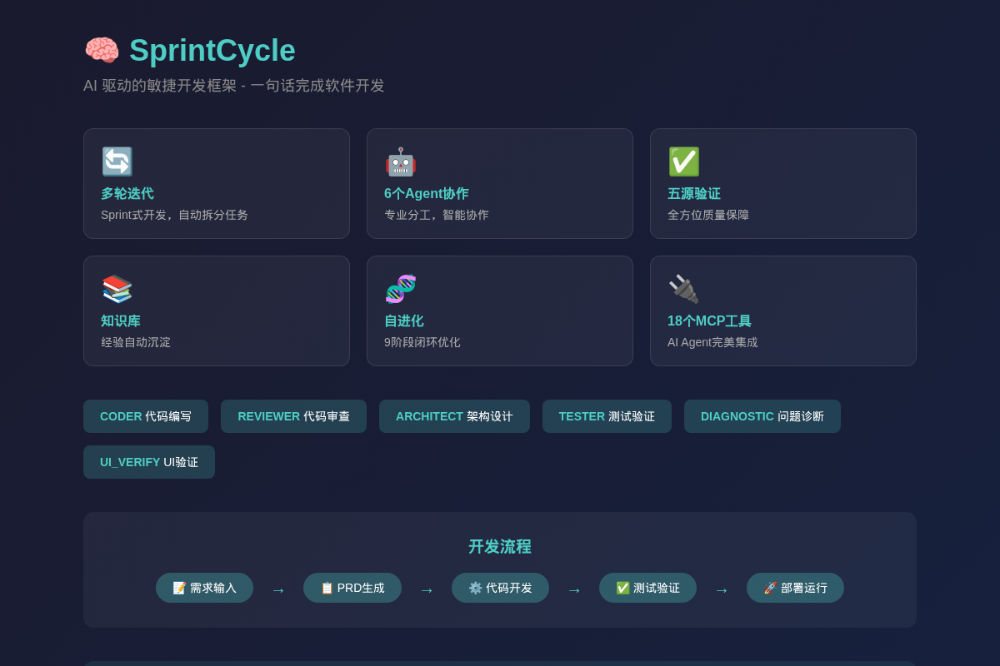

# SprintCycle

<div align="center">

**AI-Powered Agile Development Framework**

**One sentence to solve development pain**: Say goodbye to manual coding, endless test cases, and never-ending bugs — describe requirements in natural language, and SprintCycle automatically completes development, testing, and deployment.

[](LICENSE)
[](https://www.python.org/)
[](CHANGELOG.md)
[](https://codecov.io/gh/sprintcycle/sprintcycle)
[](#)

English | [简体中文](README_CN.md)

</div>

---

## 📹 30 Seconds to Understand SprintCycle

<div align="center">

https://github.com/sprintcycle/sprintcycle/raw/main/videos/demo_30s.mp4

**One sentence, one project — from requirements to deployment, fully automated**

</div>

---

## 😫 Are You Stuck in These Development Traps?

### 🔴 Pain Point 1: The Requirements-Coding Infinite Loop

```
Understand requirements → Write code → Find misunderstanding → Rewrite code → New understanding → Rewrite again → ...
     ↑                                                                                          ↓
     └──────────────────────────── Always "translating" requirements ───────────────────────────┘
```

> A simple feature, modified 5, 10 times, or even more...
> 
> Requirements change a little, code changes a lot, until you don't even know what you changed

### 🔴 Pain Point 2: The Bug Fixing Black Hole

```
Fix Bug1 → Introduce Bug2 → Fix Bug2 → Bug3 appears → Fix Bug3 → Bug4 shows up → ...
     ↑                                                                                ↓
     └────────────────────────── Fix one, break another, endless cycle ───────────────┘
```

> Every fix is小心翼翼, afraid of introducing new problems
> 
> Bugs never end, overtime till midnight, hair getting thinner

---

## ✅ SprintCycle Ends These Struggles

| Pain Point | Traditional Way | SprintCycle Way |
|------------|-----------------|-----------------|
| 🔄 Requirements-Coding Loop | Manual coding, repeated revisions | **PRD auto-generates code**, done right the first time |
| 🐛 Bug Black Hole | Manual fixes, introduce new bugs | **Intelligent diagnosis + auto-fix**, root cause resolution |
| 🔍 Code Review | Manual review, time-consuming | **AI Agent auto-review**, 24/7 available |
| 📚 Outdated Docs | Manual docs, always outdated | **Knowledge base auto-accumulates**, always synced |
| 🏗️ Chaotic Projects | Gets messier over time | **Self-evolution continuous optimization**, stronger with use |

---

## 🏗️ Architecture

<div align="center">



</div>

---

## 🔄 Execution Flow

<div align="center">



</div>

---

## 🖼️ Verification Demo

<div align="center">


**Terminal Operations → Sprint Planning → API Test Verification**
</div>

---

## 🎯 Two Usage Methods

### Way 1: CLI (Command Line)

```bash
# Initialize project
sprintcycle init -p ./myproject

# Execute development from PRD
sprintcycle run -p ./myproject --prd requirements.yaml

# Check project status
sprintcycle status -p ./myproject
```

### Way 2: OpenClaw + MCP (Recommended)

```
"Build a tech news website with news list, details, and category filtering"
```

AI automatically completes: Generate PRD → Write code → Test verification → Deploy

| Feature | CLI | OpenClaw + MCP |
|---------|-----|----------------|
| Local development | ✅ | ✅ |
| Natural language input | ❌ | ✅ |
| AI Agent integration | ❌ | ✅ |
| Auto planning | Manual | ✅ Auto |
| Target users | Developers | AI Agents |

---

## ✨ Core Features

| Feature | Description |
|---------|-------------|
| 🔄 **Multi-round Iteration** | Sprint-style development, automatic task breakdown |
| 🤖 **6 Agents** | CODER, REVIEWER, ARCHITECT, TESTER, DIAGNOSTIC, UI_VERIFY |
| ✅ **Five-source Verification** | Test, review, runtime, UI, diff verification |
| 📚 **Knowledge Base** | Auto-accumulate experience, stronger with use |
| 🧬 **Self-evolution** | 9-stage closed-loop continuous optimization |
| 🔌 **18 MCP Tools** | Perfect AI Agent integration |
| 🔐 **Secure Credentials** | Multi-layer credential management with .env.local support |
| ⚡ **AutoFix Engine** | Intelligent bug diagnosis and automatic repair |

---

## 🚀 Quick Start

```bash
# Clone repository
git clone https://github.com/sprintcycle/sprintcycle.git
cd sprintcycle

# Install dependencies
pip install -r requirements.txt

# Configure
cp .env.example .env
# Edit .env with your API keys
export LLM_API_KEY=your_key

# Start using
sprintcycle run -p ./myproject -t "Implement user authentication"
```

---

## 📚 Documentation

- [Quick Start](docs/QUICKSTART.md) - Step-by-step tutorial
- [Configuration Guide](docs/CONFIGURATION.md) - Detailed configuration options
- [Architecture Overview](docs/ARCHITECTURE.md) - System design and components

---

## 📄 License

[Apache License 2.0](LICENSE)

---

<div align="center">

**⭐ If useful, please give a Star ⭐**

**Built with ❤️ by SprintCycle Team**

</div>
