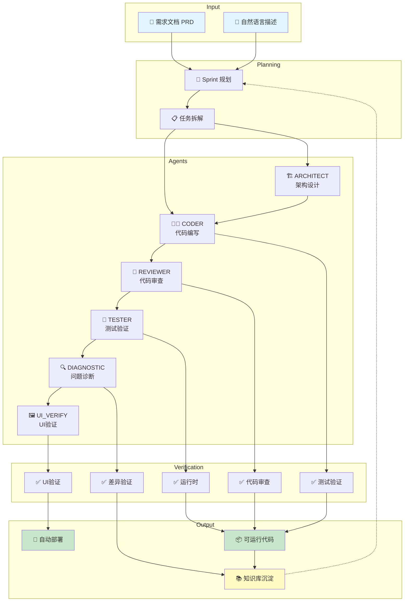
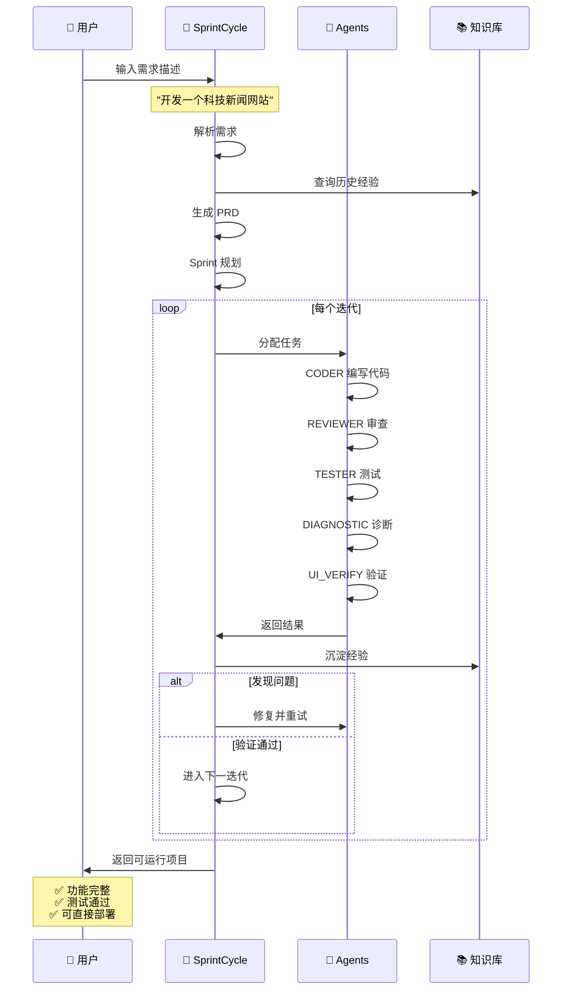

# SprintCycle

<div align="center">

**AI 驱动的敏捷开发迭代框架**

**一句话解决开发痛点**：告别手动写代码、测不完的用例、改不完的 Bug —— 用自然语言描述需求，SprintCycle 自动完成开发、测试、部署全流程。

[](LICENSE)
[](https://www.python.org/)
[](CHANGELOG.md)

[English](README.md) | 简体中文

</div>

---

## 📹 30秒快速了解 SprintCycle

<div align="center">

https://github.com/sprintcycle/sprintcycle/raw/main/videos/demo_30s.mp4

**一句话，一个项目 —— 从需求到部署全自动化**

</div>

---

## 😫 你是否深陷这些开发泥潭？

### 🔴 痛点一：需求-编码的无限循环

```
理解需求 → 写代码 → 发现理解偏差 → 重写代码 → 又有新理解 → 再改代码 → ...
     ↑                                                              ↓
     └──────────────────────── 永远在"翻译"需求的路上 ─────────────────┘
```

> 一个简单的功能，反复修改了 5 次、10 次、甚至更多...
> 
> 需求文档改一点，代码就要改一堆，改到最后自己都不知道改了什么

### 🔴 痛点二：Bug 修复的无底洞

```
修复 Bug1 → 引入 Bug2 → 修复 Bug2 → 出现 Bug3 → 修复 Bug3 → 又出现 Bug4 → ...
     ↑                                                                    ↓
     └────────────────────── 按下葫芦浮起瓢，越修越乱 ──────────────────────┘
```

> 每次修复都小心翼翼，生怕引入新问题
> 
> Bug 修不完，加班到深夜，头发越来越少

### 🔴 痛点三：测试用例写不完

```
手写测试 → 覆盖不全 → 上线出问题 → 补测试 → 新功能上线 → 又要写新测试 → ...
     ↑                                                               ↓
     └────────────────────── 测试永远追不上需求变化 ───────────────────┘
```

> 测试代码比业务代码还多，维护成本越来越高
> 
> 改一个功能，要改一堆测试，心力交瘁

---

## ✅ SprintCycle 让你告别这些痛苦

| 痛点 | 传统方式 | SprintCycle 方式 |
|------|----------|------------------|
| 🔄 需求-编码循环 | 手写代码，反复修改 | **PRD 自动生成代码**，一次到位 |
| 🐛 Bug 无底洞 | 人工修复，引入新 Bug | **智能诊断 + 自动修复**，根因解决 |
| 📝 测试写不完 | 手写测试用例 | **自动生成并执行测试**，全覆盖 |
| 🔍 代码审查 | 人工 Review，耗时耗力 | **AI Agent 自动审查**，24/7 在线 |
| 📚 文档落后 | 手写文档，总是过时 | **知识库自动沉淀**，永远同步 |
| 🏗️ 项目混乱 | 越做越乱，难以维护 | **自进化持续优化**，越用越强 |

---

## 🏗️ 架构图

<div align="center">



</div>

---

## 🔄 执行流程图

<div align="center">



</div>

---

## 🖼️ 验证过程演示

<div align="center">


**终端操作 → Sprint 规划 → API 测试验证**
</div>

---

## 🎯 两种使用方式

### 方式一：CLI（命令行）

```bash
# 初始化项目
sprintcycle init -p ./myproject

# 从 PRD 执行开发
sprintcycle run -p ./myproject --prd requirements.yaml

# 查看项目状态
sprintcycle status -p ./myproject
```

### 方式二：OpenClaw + MCP（推荐）

```
"开发一个科技新闻网站，支持新闻列表、详情和分类筛选"
```

AI 自动完成：生成 PRD → 编写代码 → 测试验证 → 部署运行

| 特性 | CLI | OpenClaw + MCP |
|------|-----|----------------|
| 本地开发 | ✅ | ✅ |
| 自然语言输入 | ❌ | ✅ |
| AI Agent 集成 | ❌ | ✅ |
| 自动规划 | 手动 | ✅ 自动 |
| 适用对象 | 开发者 | AI Agent |

---

## ✨ 核心特性

| 特性 | 说明 |
|------|------|
| 🔄 **多轮迭代** | Sprint 式开发，自动任务拆解 |
| 🤖 **6 个 Agent** | CODER、REVIEWER、ARCHITECT、TESTER、DIAGNOSTIC、UI_VERIFY |
| ✅ **五源验证** | 测试、审查、运行时、UI、差异验证 |
| 📚 **知识库** | 自动沉淀经验，越用越强 |
| 🧬 **自进化** | 9 阶段闭环持续优化 |
| 🔌 **18 个 MCP 工具** | AI Agent 完美集成 |

---

## 🚀 快速开始

```bash
# 克隆仓库
git clone https://github.com/sprintcycle/sprintcycle.git
cd sprintcycle

# 安装依赖
pip install -r requirements.txt

# 配置
cp config.yaml.example config.yaml
export LLM_API_KEY=your_key

# 开始使用
sprintcycle run -p ./myproject -t "开发用户登录功能"
```

---

## 📚 文档

- [快速入门](docs/QUICKSTART.md) - 分步教程
- [配置指南](docs/CONFIGURATION.md) - 详细配置选项
- [架构概览](docs/ARCHITECTURE.md) - 系统设计和组件

---

## 📄 许可证

[Apache License 2.0](LICENSE)

---

<div align="center">

**⭐ 如果觉得有用，请给个 Star ⭐**

**由 SprintCycle 团队用 ❤️ 构建**

</div>
