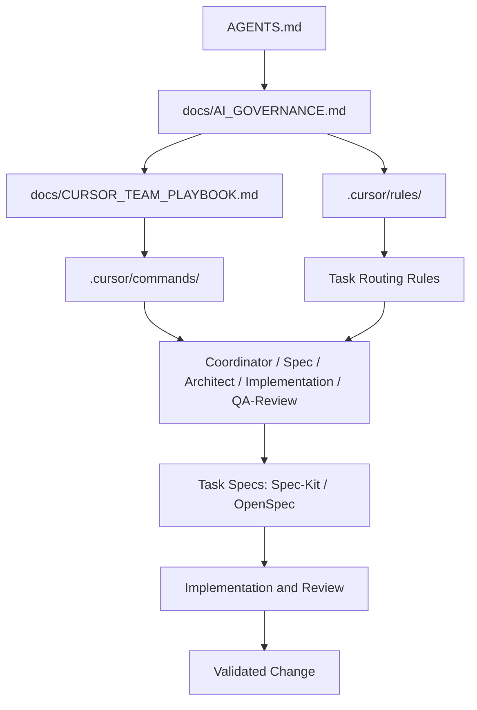

# SprintCycle AI Governance / SprintCycle AI 治理总纲

This document defines the governance model for Cursor multi-Agent collaboration in SprintCycle, including role boundaries, spec routing, rule ownership, command responsibilities, and conflict resolution.

本文档定义 SprintCycle 在 Cursor 多 Agent 协作中的治理模型，包括角色边界、规范路由、规则归属、命令职责与冲突处理。

## Document hierarchy / 文档关系

- `AGENTS.md` — repository-level baseline / 仓库级底线
- `docs/AI_GOVERNANCE.md` — governance charter / 治理总纲
- `docs/CURSOR_TEAM_PLAYBOOK.md` — execution manual / 执行手册
- `.cursor/README.md` — Cursor entry guide / Cursor 入口说明
- `.cursor/commands/README.md` — command index / 命令索引

## Recommended minimal set / 推荐最小集合

- **Core docs / 核心文档（3 份）**: `AGENTS.md`, `docs/AI_GOVERNANCE.md`, `docs/CURSOR_TEAM_PLAYBOOK.md`
- **Entry docs / 入口说明（2 份）**: `.cursor/README.md`, `.cursor/commands/README.md`
- **Core rules / 主规则（3 份）**: `sprintcycle-architecture-orchestration.mdc`, `team-routing.mdc`, `langgraph-orchestration.mdc` *(legacy reference until fully merged)*
- **Core commands / 主命令（7 个）**: `/team-command`, `/spec-command`, `/architect-command`, `/implement-command`, `/qa-command`, `/review-command`, `/commit-message-command`

## 1. Purpose / 目的

SprintCycle uses a contract-driven architecture. AI collaboration must therefore follow the same discipline: one source of truth for rules, explicit routing for task complexity, and clear separation between governance, workflow, and task-level specs.

SprintCycle 采用 contract 驱动架构，因此 AI 协作也必须遵循同样的纪律：规则只有一份真相源，任务复杂度必须显式路由，治理、流程和任务级规范必须清晰分层。

This document exists to:
- define the governance hierarchy for AI-assisted work
- prevent duplicated rule maintenance
- separate Spec-Kit and OpenSpec responsibilities
- describe how commands, documents, and agents work together
- provide a stable operating model for both small iterations and large refactors

本文档旨在：
- 定义 AI 辅助工作的治理层级
- 防止规则重复维护
- 区分 Spec-Kit 与 OpenSpec 的职责
- 说明命令、文档和 Agent 如何协作
- 为小迭代和大重构提供稳定的运行模型

## 2. Design goals / 设计目标

- Maintain a single source of truth for project-wide constraints
- Use Spec-Kit for medium/high complexity work
- Use OpenSpec for low complexity work
- Keep rules, commands, docs, and specs in separate layers
- Allow the Coordinator to route work explicitly
- Prevent Spec-Kit and OpenSpec from defining conflicting long-term constraints

- 保持项目级约束只有一份真相源
- 中高复杂度任务使用 Spec-Kit
- 低复杂度任务使用 OpenSpec
- 规则、命令、文档和规范保持分层
- 允许 Coordinator 显式路由工作
- 防止 Spec-Kit 和 OpenSpec 定义冲突的长期约束

## 3. Governance principles / 治理原则

### 3.1 Single source of truth / 单一真相源
All long-lived constraints must be defined once.

所有长期有效的约束都必须只定义一次。

Project-wide constraints include:
- architecture boundaries
- contract semantics
- state machine semantics
- testing requirements
- change boundaries
- role ownership

项目级约束包括：
- 架构边界
- contract 语义
- 状态机语义
- 测试要求
- 变更边界
- 角色归属

These constraints must live in the governance layer, not in per-task specs.

这些约束必须存在于治理层，而不是单次任务规范里。

### 3.2 Master-spec principle / 主规范原则
Spec-Kit is the primary spec system.
OpenSpec is the lightweight auxiliary spec system.

- Spec-Kit handles medium/high complexity work
- OpenSpec handles low complexity work
- neither may redefine global project rules

Spec-Kit 是主规范系统。
OpenSpec 是轻量辅助规范系统。

- Spec-Kit 负责中高复杂度工作
- OpenSpec 负责低复杂度工作
- 两者都不能重新定义全局项目规则

### 3.3 Layer separation principle / 分层原则
- Rules answer what must not change
- Commands answer how to start a workflow
- Docs explain why decisions were made
- Specs describe what this specific task must accomplish

- 规则回答“什么不能变”
- 命令回答“如何启动流程”
- 文档解释“为什么这么决定”
- 规范描述“这次任务要做什么”

### 3.4 Explicit routing principle / 显式路由原则
The Coordinator must determine the workflow path based on task complexity.
The workflow path must not be chosen informally by memory or preference.

Coordinator 必须根据任务复杂度决定工作流路径。
不能凭记忆或个人偏好随意选择流程。

## 4. Governance layers / 治理层级

### 4.1 Global rule layer / 全局规则层
This layer contains the project’s enduring constraints.

这一层包含项目长期有效的约束。

Recommended locations:
- `AGENTS.md`
- `.cursor/rules/`
- governance sections in repository docs

推荐位置：
- `AGENTS.md`
- `.cursor/rules/`
- 仓库文档中的治理章节

This layer is the canonical source for:
- architectural principles
- contract rules
- state transition constraints
- review expectations
- ownership boundaries

这一层是以下内容的规范来源：
- 架构原则
- contract 规则
- 状态流转约束
- 审查预期
- 所有权边界

### 4.2 Workflow layer / 流程层
This layer defines how work moves through the system.

这一层定义工作如何在系统中流转。

Recommended locations:
- `.cursor/commands/`
- team playbook
- routing guidance documents

推荐位置：
- `.cursor/commands/`
- 团队手册
- 路由指引文档

This layer defines:
- which workflow to use
- which agent owns which step
- when review is required
- when escalation or rollback is required

这一层定义：
- 使用哪条工作流
- 哪个 Agent 负责哪一步
- 何时需要审查
- 何时需要升级或回滚

### 4.3 Task spec layer / 任务规范层
This layer contains the current task’s working specification.

这一层包含当前任务的工作规范。

This includes:
- task objectives
- scope
- non-goals
- implementation approach
- validation criteria
- risk notes

包括：
- 任务目标
- 范围
- 非目标
- 实现方式
- 验证标准
- 风险说明

This layer is temporary and task-specific.

这一层是临时性的，只针对单次任务。

## 5. Agent roles / Agent 角色

SprintCycle’s minimum complete AI development team is intentionally small and explicit:

SprintCycle 的最小完整 AI 研发团队刻意保持精简且职责明确：

- `Coordinator`
- `Spec`
- `Architect`
- `Implementation`
- `QA/Review`

- `Coordinator`
- `Spec`
- `Architect`
- `Implementation`
- `QA/Review`

This is the smallest team that can still complete the full loop from intake to validated delivery.

这是能够从接单到验证交付完整闭环的最小团队。

### 5.1 Coordinator / 协调者
Responsibilities:
- receive the task
- classify complexity
- choose OpenSpec or Spec-Kit
- assign the next agent
- collect results
- decide whether to escalate or loop back

职责：
- 接收任务
- 判断复杂度
- 选择 OpenSpec 或 Spec-Kit
- 分配下一位 Agent
- 汇总结果
- 决定升级或回流

### 5.2 Spec / 规范编写
Responsibilities:
- turn the request into a clear task spec
- define goals, non-goals, constraints, and acceptance criteria
- choose OpenSpec for low complexity or Spec-Kit for medium/high complexity

职责：
- 将需求转成清晰的任务规范
- 定义目标、非目标、约束和验收标准
- 低复杂度选 OpenSpec，中高复杂度选 Spec-Kit

### 5.3 Architect / 架构拆分
Responsibilities:
- split the task into subproblems
- define boundaries and dependencies
- identify parallelizable work
- keep the implementation path small and safe

职责：
- 将任务拆成子问题
- 定义边界与依赖
- 找出可并行部分
- 保持实现路径小而安全

### 5.4 Implementation / 实现
Responsibilities:
- make the actual code changes
- stay within the approved spec
- avoid modifying unrelated surfaces

职责：
- 执行实际代码修改
- 严格遵守已批准规范
- 避免修改无关区域

### 5.5 QA/Review / 验证与审查
Responsibilities:
- verify behavior
- find regressions
- confirm spec compliance
- reject incomplete or inconsistent results

职责：
- 验证行为
- 发现回归
- 确认符合规范
- 拒绝不完整或不一致的结果

### 5.6 Why this is the minimum complete team / 为什么这是最小完整团队
This five-role model covers the full lifecycle of AI-assisted development without unnecessary fragmentation:
- intake and routing
- specification and scope control
- architectural decomposition
- implementation
- validation and review

这个五角色模型覆盖了 AI 辅助开发的完整生命周期，而不会产生不必要的碎片化：
- 接单与路由
- 规范与范围控制
- 架构拆分
- 实现
- 验证与审查

Any smaller model increases the risk of unclear ownership. Any larger model should be justified by scale, not used as the default.

更小的模型会增加职责不清的风险。更大的模型必须由规模需求证明，而不能作为默认配置。

## 6. Routing policy / 路由策略

### 6.1 Low complexity / 低复杂度
Use OpenSpec when the task is:
- single file or very small surface area
- low risk
- no architectural change
- no contract change
- no cross-layer dependency

当任务满足以下条件时，使用 OpenSpec：
- 单文件或极小范围
- 低风险
- 无架构变化
- 无 contract 变化
- 无跨层依赖

Recommended flow:
- Coordinator
- OpenSpec
- Implementation
- QA/Review
- Complete

推荐流程：
- Coordinator
- OpenSpec
- Implementation
- QA/Review
- 完成

### 6.2 Medium complexity / 中复杂度
Use Spec-Kit when the task is:
- multi-file
- boundary-sensitive
- moderate regression risk
- requires explicit acceptance criteria
- likely to need review loops

当任务满足以下条件时，使用 Spec-Kit：
- 多文件
- 边界敏感
- 中等回归风险
- 需要明确验收标准
- 可能需要多轮审查

Recommended flow:
- Coordinator
- Spec-Kit
- Architect
- Implementation
- QA/Review
- Complete

推荐流程：
- Coordinator
- Spec-Kit
- Architect
- Implementation
- QA/Review
- 完成

### 6.3 High complexity / 高复杂度
Use Spec-Kit when the task is:
- architecture refactor
- contract or state machine change
- cross-layer migration
- runtime or governance behavior change
- any high-risk work

当任务满足以下条件时，使用 Spec-Kit：
- 架构重构
- contract 或状态机变更
- 跨层迁移
- 运行时或治理行为变更
- 任何高风险工作

Recommended flow:
- Coordinator
- Spec-Kit
- Architect
- Implementation
- QA/Review
- Loop back if needed
- Complete

推荐流程：
- Coordinator
- Spec-Kit
- Architect
- Implementation
- QA/Review
- 必要时回流
- 完成

## 7. Conflict prevention / 冲突预防

### 7.1 What may not be duplicated / 哪些内容不能重复
The following must not be redefined in multiple places:
- global architecture constraints
- contract semantics
- state machine rules
- ownership boundaries
- review gating rules

以下内容不得在多个地方重复定义：
- 全局架构约束
- contract 语义
- 状态机规则
- 所有权边界
- 审查门禁规则

### 7.2 What specs may contain / 规范里可以包含什么
Task specs may contain:
- goals
- non-goals
- task-specific constraints
- implementation notes
- acceptance criteria
- validation steps

任务规范可以包含：
- 目标
- 非目标
- 任务专属约束
- 实现说明
- 验收标准
- 验证步骤

### 7.3 What specs may not contain / 规范里不可以包含什么
Task specs may not:
- redefine global project rules
- override governance documents
- create parallel “truth sources”

任务规范不可以：
- 重新定义全局项目规则
- 覆盖治理文档
- 创建平行“真相源”

### 7.4 Conflict resolution priority / 冲突处理优先级
When documents disagree, use this order:
1. `AGENTS.md`
2. `docs/AI_GOVERNANCE.md`
3. `.cursor/rules/`
4. `.cursor/commands/`
5. task spec documents
6. ad hoc notes

当文档冲突时，按以下顺序处理：
1. `AGENTS.md`
2. `docs/AI_GOVERNANCE.md`
3. `.cursor/rules/`
4. `.cursor/commands/`
5. 任务规范文档
6. 临时说明

## 8. Quality gates and return-to-owner / 质量门禁与回流归属

Quality gates are part of the governance model.

质量门禁属于治理模型的一部分。

### 8.1 Gate outcomes / 门禁结果
Every role must be able to produce one of three outcomes:
- `approve`
- `request changes`
- `loop back`

每个角色都必须能给出三种结果之一：
- `approve`
- `request changes`
- `loop back`

### 8.2 Return-to-owner matrix / 回流归属表
- Requirement ambiguity / 需求不清楚 -> `team-agent`
- Spec incompleteness / 规范不完整 -> `spec-agent`
- Boundary or dependency ambiguity / 边界或依赖不清晰 -> `architect-agent`
- Scope creep or implementation overreach / 范围扩大或实现越界 -> `implement-agent`
- Missing tests or high regression risk / 缺失测试或高回归风险 -> `qa-agent`
- Conflicting cross-role conclusions / 跨角色结论冲突 -> `review-agent`

- 需求不清楚 -> `team-agent`
- 规范不完整 -> `spec-agent`
- 边界或依赖不清晰 -> `architect-agent`
- 范围扩大或实现越界 -> `implement-agent`
- 缺失测试或高回归风险 -> `qa-agent`
- 跨角色结论冲突 -> `review-agent`

### 8.3 Blocking criteria / 阻断条件
A gate must block progression when the change:
- breaks the `ReleasePlan → SprintOrchestrator.execute_release_plan → SprintExecutor` chain
- bypasses governance, observability, suggestion, or evolution flows
- violates architecture boundaries or introduces parallel orchestration paths
- leaves critical regression risk unresolved

当改动出现以下情况时，门禁必须阻断推进：
- 破坏 `ReleasePlan → SprintOrchestrator.execute_release_plan → SprintExecutor` 主链路
- 绕过 governance、observability、suggestion 或 evolution 流程
- 违反架构边界或引入平行编排路径
- 关键回归风险未解决

### 8.4 Review authority / Review 权限
`review-agent` is the final gate for consolidated decisions.
`qa-agent` is the quality gate for implementation readiness.

`review-agent` 是综合决策的最终门禁。
`qa-agent` 是实现就绪的质量门禁。

## 9. Delivery observability and retro / 交付可观测性与复盘

Delivery observability is part of governance because SprintCycle improves by measuring routing, gates, returns, and final decisions.

交付可观测性属于治理的一部分，因为 SprintCycle 需要通过路由、门禁、回流和最终结论来持续改进。

### 9.1 What should be recorded / 应记录什么
Record only the metadata that helps improve delivery quality:
- task summary / 任务摘要
- routing path / 路由路径
- complexity level / 复杂度等级
- gates triggered / 触发的门禁
- return-to-owner events / 回流归属事件
- final verdict / 最终结论
- key risks / 关键风险
- lessons learned / 复盘结论

只记录能帮助提升交付质量的元数据：
- 任务摘要
- 路由路径
- 复杂度等级
- 触发的门禁
- 回流归属事件
- 最终结论
- 关键风险
- 复盘结论

### 9.2 What retro should answer / 复盘应回答什么
A retro should answer:
- which route was chosen and why
- where the task returned and why
- which gate blocked progress
- which agent most often needed correction
- which rule or template should be strengthened

复盘应回答：
- 为什么选择这条路由
- 问题回到了哪里、为什么
- 哪个门禁阻断了推进
- 哪个 Agent 最常需要纠正
- 哪条规则或模板应该加强

### 9.3 Governance feedback loop / 治理反馈闭环
Retro findings should be used to improve:
- agent behavior constraints
- command routing
- playbook gate rules
- quality thresholds

复盘结果应反向用于改进：
- Agent 行为约束
- 命令路由
- 执行手册中的门禁规则
- 质量阈值

### 9.4 Review retro summary / Review 复盘摘要
`review-agent` should produce a concise retro summary for each completed task so governance can archive and analyze delivery patterns consistently.

`review-agent` 应为每个完成的任务产出简洁的复盘摘要，以便治理层统一归档和分析交付模式。

Recommended fields:
- task summary / 任务摘要
- routing path / 路由路径
- gates triggered / 触发的门禁
- return-to-owner events / 回流归属事件
- blocking reasons / 阻断原因
- final verdict / 最终结论
- lessons learned / 复盘结论
- rule updates needed / 需要更新的规则

推荐字段：
- 任务摘要
- 路由路径
- 触发的门禁
- 回流归属事件
- 阻断原因
- 最终结论
- 复盘结论
- 需要更新的规则

### 9.5 Structured task record template / 结构化任务记录模板
Every meaningful task should produce a structured record that can be archived, queried, and used for retrospection.

每个有意义的任务都应产出一份结构化记录，便于归档、查询和复盘。

```text
Task ID
Task summary
Task type
Complexity level
Routing path
Workflow mode
Critical chain hit
Critical component hit
Gates triggered
Return-to-owner events
Blocking reasons
Missing tests
Final verdict
Lessons learned
Rule updates needed
```

## 10. Documentation ownership / 文档归属

### 8.1 `docs/AI_GOVERNANCE.md`
The canonical governance document.

`docs/AI_GOVERNANCE.md` 是规范性的治理文档。

### 8.2 `docs/CURSOR_TEAM_PLAYBOOK.md`
The operational guide for the team model and command flow.

`docs/CURSOR_TEAM_PLAYBOOK.md` 是团队模型与命令流程的执行指南。

### 8.3 `AGENTS.md`
The repository-level baseline AI collaboration contract.

`AGENTS.md` 是仓库级 AI 协作底线。

### 8.4 Task specs
Generated per task, temporary, and always subordinate to governance.

任务规范按任务生成，是临时性的，并始终从属于治理层。

## 9. Maintenance rules / 维护规则

- Keep global rules in one place
- Do not mirror the same constraint in Spec-Kit and OpenSpec
- Update governance first when rules change
- Update workflow docs when routing changes
- Update task specs only for task-specific changes

- 全局规则只保留一份
- 不要在 Spec-Kit 和 OpenSpec 中镜像同一约束
- 规则变化时先更新治理层
- 路由变化时更新流程文档
- 任务规范只更新任务专属内容

## 10. Governance overview diagram / 治理总览图



## 11. Summary / 总结

SprintCycle uses a layered governance model:
- rules define what is stable
- commands define how to start work
- docs explain why decisions exist
- specs define what a specific task must do

SprintCycle 使用分层治理模型：
- 规则定义什么是稳定的
- 命令定义如何启动工作
- 文档解释为什么会有这些决策
- 规范定义某个任务要做什么

Spec-Kit is the master spec system.
OpenSpec is the lightweight auxiliary spec system.
The Coordinator decides which one to use based on complexity.

Spec-Kit 是主规范系统。
OpenSpec 是轻量辅助规范系统。
Coordinator 根据复杂度决定使用哪一种。
