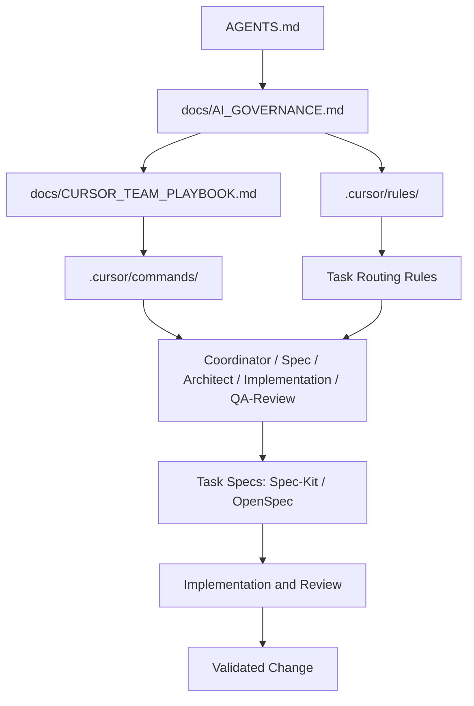
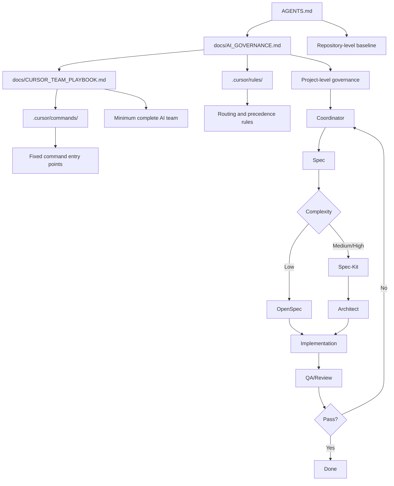

# SprintCycle AI Governance

This document defines the governance model for Cursor multi-Agent collaboration in SprintCycle, including role boundaries, spec routing, rule ownership, command responsibilities, and conflict resolution.

## 1. Purpose

SprintCycle uses a contract-driven architecture. AI collaboration must therefore follow the same discipline: one source of truth for rules, explicit routing for task complexity, and clear separation between governance, workflow, and task-level specs.

This document exists to:
- define the governance hierarchy for AI-assisted work
- prevent duplicated rule maintenance
- separate Spec-Kit and OpenSpec responsibilities
- describe how commands, documents, and agents work together
- provide a stable operating model for both small iterations and large refactors

## 2. Design goals

- Maintain a single source of truth for project-wide constraints
- Use Spec-Kit for medium/high complexity work
- Use OpenSpec for low complexity work
- Keep rules, commands, docs, and specs in separate layers
- Allow the Coordinator to route work explicitly
- Prevent Spec-Kit and OpenSpec from defining conflicting long-term constraints

## 3. Governance principles

### 3.1 Single source of truth
All long-lived constraints must be defined once.

Project-wide constraints include:
- architecture boundaries
- contract semantics
- state machine semantics
- testing requirements
- change boundaries
- role ownership

These constraints must live in the governance layer, not in per-task specs.

### 3.2 Master-spec principle
Spec-Kit is the primary spec system.
OpenSpec is the lightweight auxiliary spec system.

- Spec-Kit handles medium/high complexity work
- OpenSpec handles low complexity work
- neither may redefine global project rules

### 3.3 Layer separation principle
- Rules answer what must not change
- Commands answer how to start a workflow
- Docs explain why decisions were made
- Specs describe what this specific task must accomplish

### 3.4 Explicit routing principle
The Coordinator must determine the workflow path based on task complexity.
The workflow path must not be chosen informally by memory or preference.

## 4. Governance layers

### 4.1 Global rule layer
This layer contains the project’s enduring constraints.

Recommended locations:
- `AGENTS.md`
- `.cursor/rules/`
- governance sections in repository docs

This layer is the canonical source for:
- architectural principles
- contract rules
- state transition constraints
- review expectations
- ownership boundaries

### 4.2 Workflow layer
This layer defines how work moves through the system.

Recommended locations:
- `.cursor/commands/`
- team playbook
- routing guidance documents

This layer defines:
- which workflow to use
- which agent owns which step
- when review is required
- when escalation or rollback is required

### 4.3 Task spec layer
This layer contains the current task’s working specification.

This includes:
- task objectives
- scope
- non-goals
- implementation approach
- validation criteria
- risk notes

This layer is temporary and task-specific.

## 5. Agent roles

SprintCycle’s minimum complete AI development team is intentionally small and explicit:

- `Coordinator`
- `Spec`
- `Architect`
- `Implementation`
- `QA/Review`

This is the smallest team that can still complete the full loop from intake to validated delivery.

### 5.1 Coordinator
Responsibilities:
- receive the task
- classify complexity
- choose OpenSpec or Spec-Kit
- assign the next agent
- collect results
- decide whether to escalate or loop back

### 5.2 Spec
Responsibilities:
- turn the request into a clear task spec
- define goals, non-goals, constraints, and acceptance criteria
- choose OpenSpec for low complexity or Spec-Kit for medium/high complexity

### 5.3 Architect
Responsibilities:
- split the task into subproblems
- define boundaries and dependencies
- identify parallelizable work
- keep the implementation path small and safe

### 5.4 Implementation
Responsibilities:
- make the actual code changes
- stay within the approved spec
- avoid modifying unrelated surfaces

### 5.5 QA/Review
Responsibilities:
- verify behavior
- find regressions
- confirm spec compliance
- reject incomplete or inconsistent results

### 5.6 Why this is the minimum complete team
This five-role model covers the full lifecycle of AI-assisted development without unnecessary fragmentation:
- intake and routing
- specification and scope control
- architectural decomposition
- implementation
- validation and review

Any smaller model increases the risk of unclear ownership. Any larger model should be justified by scale, not used as the default.

## 6. Routing policy

### 6.1 Low complexity
Use OpenSpec when the task is:
- single file or very small surface area
- low risk
- no architectural change
- no contract change
- no cross-layer dependency

Recommended flow:
- Coordinator
- OpenSpec
- Implementation
- QA/Review
- Complete

### 6.2 Medium complexity
Use Spec-Kit when the task is:
- multi-file
- boundary-sensitive
- moderate regression risk
- requires explicit acceptance criteria
- likely to need review loops

Recommended flow:
- Coordinator
- Spec-Kit
- Architect
- Implementation
- QA/Review
- Complete

### 6.3 High complexity
Use Spec-Kit when the task is:
- architecture refactor
- contract or state machine change
- cross-layer migration
- runtime or governance behavior change
- any high-risk work

Recommended flow:
- Coordinator
- Spec-Kit
- Architect
- Implementation
- QA/Review
- Loop back if needed
- Complete

## 7. Conflict prevention

### 7.1 What may not be duplicated
The following must not be redefined in multiple places:
- global architecture constraints
- contract semantics
- state machine rules
- ownership boundaries
- review gating rules

### 7.2 What specs may contain
Task specs may contain:
- goals
- non-goals
- task-specific constraints
- implementation notes
- acceptance criteria
- validation steps

### 7.3 What specs may not contain
Task specs may not:
- redefine global project rules
- override governance documents
- create parallel “truth sources”

### 7.4 Conflict resolution priority
When documents disagree, use this order:
1. `AGENTS.md`
2. `docs/AI_GOVERNANCE.md`
3. `.cursor/rules/`
4. `.cursor/commands/`
5. task spec documents
6. ad hoc notes

## 8. Documentation ownership

### 8.1 `docs/AI_GOVERNANCE.md`
The canonical governance document.

### 8.2 `docs/CURSOR_TEAM_PLAYBOOK.md`
The operational guide for the team model and command flow.

### 8.3 `AGENTS.md`
The repository-level baseline AI collaboration contract.

### 8.4 Task specs
Generated per task, temporary, and always subordinate to governance.

## 9. Maintenance rules

- Keep global rules in one place
- Do not mirror the same constraint in Spec-Kit and OpenSpec
- Update governance first when rules change
- Update workflow docs when routing changes
- Update task specs only for task-specific changes

## 10. Governance overview diagram

## 11. Governance overview diagram

## 12. Summary

SprintCycle uses a layered governance model:
- rules define what is stable
- commands define how to start work
- docs explain why decisions exist
- specs define what a specific task must do

Spec-Kit is the master spec system.
OpenSpec is the lightweight auxiliary spec system.
The Coordinator decides which one to use based on complexity.
