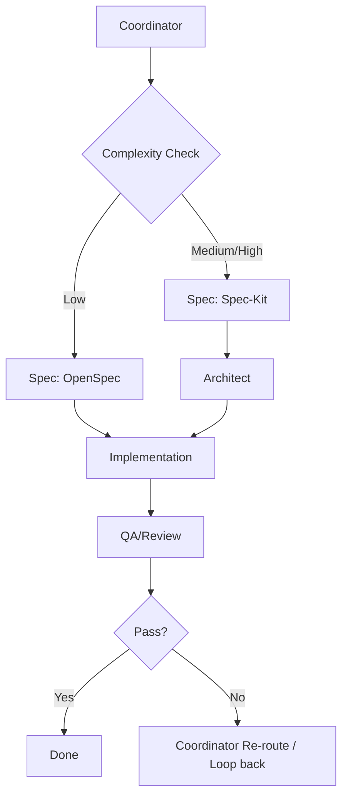

# SprintCycle IT 研发团队流程

本文档定义 SprintCycle 的 IT 研发任务正式执行流程。
It standardizes how work is classified, spec'd, architected, implemented, reviewed, and either completed or routed back for another pass.

## 1. Purpose / 目的

这个流程用于让多步骤工程任务的交付保持有序、可预测。
This workflow exists to keep delivery disciplined and predictable for multi-step engineering work. It prevents ad hoc execution by ensuring each task passes through the appropriate role stages in the correct order.

## 2. Flow overview / 流程总览

```text
Coordinator -> Complexity Check -> Spec (OpenSpec / Spec-Kit) -> Architect -> Implementation -> QA/Review -> Pass / Loop
```

## 3. Role responsibilities / 角色职责

### 3.1 Coordinator
职责：
- 接收需求
- 判断是否适合进入该流程
- 对任务做初步分类
- 路由到正确的 Spec 路径
- 收集 review 反馈并决定是否回流

Responsibilities:
- receive the request
- determine whether the task is suitable for this workflow
- classify the task at a high level
- route the task to the correct spec path
- collect review feedback and decide whether to loop back

输出 / Output:
- 任务分类 / task classification
- 路由选择 / route selection
- 主要风险 / main risks
- 下一步 / next step

### 3.2 Complexity Check
使用复杂度检查来决定 spec 路径。
Use the complexity check to decide the spec path.

#### 低复杂度 / Low complexity
典型信号 / Typical signals:
- 单文件或非常小的修改面 / single file or very small surface area
- 风险低 / low risk
- 不改 contract / no contract change
- 不改架构 / no architecture change

Route:
- `Spec: OpenSpec`

#### 中 / 高复杂度 / Medium / High complexity
典型信号 / Typical signals:
- 多文件 / multiple files
- 跨层变更 / cross-layer change
- 边界敏感 / boundary-sensitive work
- 影响 contract 或架构 / contract or architecture impact
- 回归风险更高 / higher regression risk

Route:
- `Spec: Spec-Kit`

### 3.3 Spec
Spec 阶段会把需求转成明确、可审阅的工作约定。
The spec stage turns the request into an explicit working agreement.

#### OpenSpec
适用于小型、低风险任务。
Use for small, low-risk tasks.

必须包含 / Must define:
- 目标 / goal
- 非目标 / non-goals
- 范围 / scope
- 验收标准 / acceptance criteria

#### Spec-Kit
适用于中高复杂度任务。
Use for medium/high complexity tasks.

必须包含 / Must define:
- 目标 / goal
- 非目标 / non-goals
- 范围 / scope
- 约束 / constraints
- 验收标准 / acceptance criteria
- 风险 / risks
- 实施建议 / implementation guidance

### 3.4 Architect
Architect 阶段负责在实现前拆解任务。
The architect stage decomposes the task before implementation.

职责：
- 拆分为安全的子步骤 / split the task into safe sub-steps
- 定义边界与依赖 / define boundaries and dependencies
- 确定实现顺序 / identify the implementation order
- 控制改动面 / limit the change surface

输出 / Output:
- 子任务拆分 / subtask breakdown
- 依赖说明 / dependency notes
- 文件 / 模块边界 / file/module boundaries
- 实现顺序 / implementation order

### 3.5 Implementation
Implementation 阶段负责实际改代码。
The implementation stage performs the code change.

职责：
- 只实现已批准的范围 / implement only within the approved scope
- 保持改动局部化 / keep changes localized
- 避免无关重构 / avoid unrelated refactors
- 在未明确要求前，保持现有 contract 与架构语义 / preserve existing contract and architecture semantics unless explicitly asked to change them

输出 / Output:
- 改了什么 / files changed
- 行为变化 / behavior changed
- 自检说明 / self-check notes

### 3.6 QA / Review
Review 阶段负责验证改动。
The review stage validates the change.

职责：
- 对照 spec 验证实现 / verify the implementation against the spec
- 检查回归 / check for regressions
- 确认测试与 lint（如相关）/ confirm tests and lint pass where relevant
- 提出后续修复项 / identify follow-up fixes if needed

输出 / Output:
- 验证总结 / validation summary
- 发现的问题 / issues found
- 通过 / 不通过 / pass / fail verdict

### 3.7 Pass / Loop
如果 review 通过，任务结束。
If review passes, the task is done.

如果 review 不通过，回到 Coordinator 重新评估并进入下一轮流程。
If review fails, route back to the Coordinator for reassessment and another pass through the workflow.

## 4. Formal execution policy / 正式执行规则

- 中 / 高复杂度任务必须先走 Spec-Kit，再走 Architect，然后再进入 implementation。
- Medium/high complexity tasks must go through Spec-Kit and Architect before implementation.
- 低复杂度任务可以使用 OpenSpec；只有在变更足够局部时，才可以跳过 Architect。
- Low complexity tasks may use OpenSpec and skip Architect only when the change is clearly localized.
- 所有非平凡变更都必须经过 QA/Review。
- QA/Review is mandatory for all non-trivial changes.
- 如果 implementation 暴露出隐藏依赖，必须回流 Coordinator。
- If implementation reveals hidden dependencies, the task must loop back through Coordinator.
- 如果 review 发现 spec 不匹配，必须回流到 Spec 或 Architect。
- If review finds a spec mismatch, the task must loop back to Spec or Architect as needed.

## 5. Recommended output format / 推荐输出格式

每个阶段都应保持输出短小、结构化。
Each stage should keep output short and structured.

### Coordinator
- 分类 / classification
- 复杂度 / complexity
- 路由 / route
- 风险 / risk
- 下一步 / next step

### Spec
- 目标 / goal
- 非目标 / non-goals
- 范围 / scope
- 约束 / constraints
- 验收标准 / acceptance criteria
- 路由 / route

### Architect
- 拆分 / breakdown
- 依赖 / dependencies
- 边界 / boundaries
- 实现顺序 / implementation order
- 风险 / risks

### Implementation
- 改动 / changes made
- 文件 / files touched
- 验证 / validation notes

### QA / Review
- 验证结果 / validation result
- 缺失检查 / missing checks
- 后续项 / follow-up items
- 结论 / verdict

## 6. Reference flow / 参考流程



## 7. Maintenance notes / 维护说明

- Keep this flow aligned with `docs/AI_GOVERNANCE.md`, `docs/CURSOR_TEAM_PLAYBOOK.md`, and `docs/SPEC_KIT.md`.
- Update this document when the team process changes.
- Do not use it to redefine global governance rules; it only describes execution flow.
