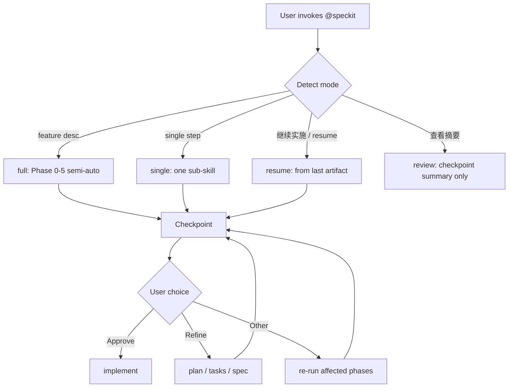

# Speckit Skill User Guide (Speckit Skill 使用指南)

This document describes how to use the **semi-automated Speckit workflow** in SprintCycle via Cursor Agent Skills. (本文说明如何在 SprintCycle 中通过 Cursor Agent Skill 使用 **Speckit 半自动工作流**。)

**Canonical skill entry:** `.cursor/skills/speckit/SKILL.md`  
**Legacy command shim:** `.cursor/commands/speckit.md` (routes to the skill only)

**External parity reference:** [Speckit-mcp-x](https://github.com/ElliotLion-ing/Speckit-mcp-x) — this project uses the skill orchestrator instead of MCP when MCP is not configured. (外部对标：[Speckit-mcp-x](https://github.com/ElliotLion-ing/Speckit-mcp-x)；未配置 MCP 时由本 skill 提供同等半自动体验。)

---

## Table of contents (目录)

1. [What it does (功能概览)](#what-it-does-功能概览)
2. [Prerequisites (前置条件)](#prerequisites-前置条件)
3. [How to invoke (如何调用)](#how-to-invoke-如何调用)
4. [Operating modes (运行模式)](#operating-modes-运行模式)
5. [Full semi-automated pipeline (全流程半自动)](#full-semi-automated-pipeline-全流程半自动)
6. [Checkpoint (强制检查点)](#checkpoint-强制检查点)
7. [Usage examples (使用示例)](#usage-examples-使用示例)
8. [Artifact layout (产物目录结构)](#artifact-layout-产物目录结构)
9. [Sub-skills reference (子 Skill 索引)](#sub-skills-reference-子-skill-索引)
10. [Comparison with other entry points (与其他入口对比)](#comparison-with-other-entry-points-与其他入口对比)
11. [Troubleshooting (故障排查)](#troubleshooting-故障排查)
12. [FAQ (常见问题)](#faq-常见问题)

---

## What it does (功能概览)

The `speckit` skill is the **orchestrator** for Spec-Driven Development (SDD) in this repository. (本 skill 是本仓库中**规格驱动开发（SDD）**的编排入口。)

It does **not** replace the detailed logic in sub-skills; it **coordinates** them in order:

```text
Preflight → Constitution → Specify → Clarify (if needed) → Plan → Tasks
    → CHECKPOINT (mandatory stop)
    → Implement (only after your explicit approval)
```

**Semi-automation means:**

| Automated (自动) | Manual gate (需人工) |
|------------------|----------------------|
| Phase 0–5 run back-to-back in **full** mode | Clarify may ask up to 5 questions |
| Agent does not ask 「是否继续」 between phases | **Checkpoint** after `tasks.md` |
| Progress lines after each phase | **Implement** only after you approve |

This matches the checkpoint behavior documented in [Speckit-mcp-x](https://github.com/ElliotLion-ing/Speckit-mcp-x): pause after tasks, review documents, then continue on approval. (与 Speckit-mcp-x 文档一致：tasks 后暂停审阅，批准后再实施。)

---

## Prerequisites (前置条件)

### Required (必需)

| Item | Path / command | Notes |
|------|----------------|-------|
| Spec-kit workspace | `.specify/` | Created by `specify init` or project onboarding |
| Sub-skills | `.cursor/skills/speckit-*/SKILL.md` | Installed via `cursor-agent` integration |
| Cursor | Cursor IDE with Agent | User invokes `@speckit` or natural-language triggers |

Verify sub-skills exist:

```bash
ls .cursor/skills/speckit-*/SKILL.md
```

Expected minimum set:

- `speckit-constitution`, `speckit-specify`, `speckit-clarify`, `speckit-plan`, `speckit-tasks`, `speckit-implement`

### Optional (可选)

| Item | Purpose |
|------|---------|
| `specify` CLI (`~/.local/bin/specify`) | Version check, scripts; **not required** for skill-only flow |
| `speckit-git-feature` | Feature branch creation per team convention |
| `speckit-analyze` | Cross-artifact consistency check at checkpoint |
| Speckit MCP (`speckit-mcp-x`) | Alternative transport; **orchestration should still follow this skill** unless you explicitly request MCP tools |

### First-time project setup (首次初始化)

If `.specify/` is missing:

```bash
specify init
# or follow your team's spec-kit onboarding
```

Then ensure Cursor integration skills are present under `.cursor/skills/`.

---

## How to invoke (如何调用)

### Primary method: @ mention (主要方式)

In Cursor Agent chat:

```text
@speckit 为 SprintCycle 增加 XXX 功能，技术栈保持现有 Python + Vue 架构
```

Or:

```text
@.cursor/skills/speckit 用 speckit 全流程：重构 internal API 的鉴权层
```

The skill has `disable-model-invocation: true`, so the Agent **will not auto-pick** this skill—you should **@ mention** it when starting SDD work. (该 skill 不会被动自动触发，开始 SDD 时请主动 @。)

### Natural-language triggers (自然语言触发)

After `@speckit`, these phrases select the mode:

| Phrase | Mode |
|--------|------|
| *(feature description only)* | **full** — semi-auto Phase 0→5 |
| `speckit 全流程` / `半自动` | **full** |
| `只执行 specify` / `执行 plan 步骤` | **single** |
| `继续实施` / `开始 implement` | **resume** → implement (after checkpoint) |
| `从 checkpoint 继续` | **resume** |
| `查看文档摘要` / `review documents` | **review** |

### Legacy command (旧命令)

`/speckit` or `.cursor/commands/speckit.md` is a **compatibility shim** only. It delegates to this skill; do not expect extra logic there. (旧命令仅为兼容层。)

---

## Operating modes (运行模式)



| Mode | When to use | Stops after |
|------|-------------|-------------|
| **full** (default) | New feature from description | Checkpoint (after tasks) |
| **single** | Debug one phase, or partial rerun | That sub-skill (+ checkpoint if tasks) |
| **resume** | Continue interrupted work | Next incomplete phase or implement |
| **review** | Read summary without changing code | Summary only |

---

## Full semi-automated pipeline (全流程半自动)

### Phase overview (阶段一览)

| Phase | Name | Sub-skill | Main output |
|-------|------|-----------|-------------|
| 0 | Preflight (预检) | *(orchestrator)* | Status report; abort if broken |
| 1 | Constitution (宪章) | `speckit-constitution` | `.specify/memory/constitution.md` |
| 2 | Specify (规格) | `speckit-specify` | `specs/<feature>/spec.md` |
| 3 | Clarify (澄清) | `speckit-clarify` | Updated `spec.md` (conditional) |
| 4 | Plan (计划) | `speckit-plan` | `specs/<feature>/plan.md` + design artifacts |
| 5 | Tasks (任务) | `speckit-tasks` | `specs/<feature>/tasks.md` |
| — | **Checkpoint** | *(orchestrator)* | Summary + menu; **STOP** |
| 6 | Implement (实施) | `speckit-implement` | Code changes per tasks |

Between phases in **full** mode, the Agent prints a short progress line, for example:

```text
✅ Phase 2 complete: Specify → continuing
```

It should **not** ask 「要继续吗？」 between phases. (阶段之间不应反复确认是否继续。)

### Phase 0 — Preflight (预检)

The Agent checks:

- `.specify/` exists
- Required sub-skills exist
- `.specify/integration.json` (if present)
- Active feature directory (for **resume**)
- `specify` CLI version (advisory only)

Example output:

```text
Speckit preflight
- .specify/: OK
- Sub-skills: OK
- Active feature: (new feature)
- Mode: full
```

If preflight fails (e.g. missing `.specify/`), the run **stops** before Phase 1. (预检失败则不会进入后续阶段。)

### Phase 3 — Clarify gate (澄清门控)

After `spec.md` is created, the orchestrator scans for:

- `[NEEDS CLARIFICATION]`
- `TBD` / obvious blocking ambiguities

| Condition | Action |
|-----------|--------|
| No markers, or user said `跳过 clarify` | Skip → Plan |
| Markers found | Run `speckit-clarify` (may ask ≤5 questions) |
| User said exploratory spike | Skip with one-time warning |

### What full mode does **not** do (全流程不会做的事)

- Does **not** run `specify workflow run speckit` (CLI bundled workflow)
- Does **not** start **implement** without checkpoint approval
- Does **not** skip failed phases

---

## Checkpoint (强制检查点)

After `tasks.md` is generated, the workflow **always stops**. (生成 `tasks.md` 后必须停止。)

### Documents reviewed (审阅文档)

| Document | Path |
|----------|------|
| Constitution | `.specify/memory/constitution.md` |
| Specification | `specs/<feature>/spec.md` |
| Plan | `specs/<feature>/plan.md` |
| Tasks | `specs/<feature>/tasks.md` |

### Summary format (摘要格式)

The Agent provides a **structured summary** (not full file dumps):

1. **Goal** — one sentence  
2. **Scope** — bullet list  
3. **Plan highlights** — architecture / key decisions  
4. **Tasks** — count, phases, critical path  
5. **Risks / open questions** — if any  

### Checkpoint menu (检查点菜单)

```text
Tasks have been generated. Please review:
- Constitution (.specify/memory/constitution.md)
- Specifications (specs/<feature>/spec.md)
- Plan (specs/<feature>/plan.md)
- Tasks (specs/<feature>/tasks.md)

Would you like to:
1. ✅ Proceed with implementation
2. 📝 Refine the plan or tasks
3. 🔄 Make other adjustments
```

**Important:** In the same turn as this menu, the Agent must **not** start coding. Wait for your reply. (输出菜单的同一轮对话中不得开始写代码。)

### Your responses (如何回复)

| Your intent | Example phrases | Agent action |
|-------------|-----------------|--------------|
| Approve implement | `继续实施`, `开始 implement`, `proceed`, `option 1`, `批准` | Run `speckit-implement` |
| Refine plan/tasks | `修改 plan`, `refine tasks`, `option 2` | Re-run plan/tasks → checkpoint again |
| Other changes | `改 spec`, `option 3` | Re-run affected phases → checkpoint |
| Summary only | `查看生成的文档摘要` | Summarize only, stay at checkpoint |
| Consistency check | `运行 analyze` | Optional `speckit-analyze`, then checkpoint |

---

## Usage examples (使用示例)

### Example 1 — New feature, full semi-auto (新功能全流程)

**You say:**

```text
@speckit 为 Dashboard 增加 lifecycle contract 导出为 JSON 的功能，
支持按 contract_id 过滤，保持现有 internal API 分层不变。
```

**Agent behavior:**

1. Preflight → OK  
2. Runs constitution → specify → clarify (if needed) → plan → tasks **without asking between steps**  
3. Stops at checkpoint with summary + menu  

**You say:**

```text
继续实施
```

**Agent behavior:** Runs `speckit-implement` according to `tasks.md`.

---

### Example 2 — Single step only (单步执行)

**You say:**

```text
@speckit 只执行 plan，feature 目录是 specs/20260519-api-layering-refactor/
```

**Agent behavior:** Preflight (if needed) → `speckit-plan` only → stop (no tasks, no implement).

---

### Example 3 — Resume after interruption (中断恢复)

**You say:**

```text
@speckit 从 checkpoint 继续，feature 是 specs/20260519-frontend-interface-boundary/
```

**Agent behavior:**

- If `tasks.md` exists and you have not approved → show checkpoint again  
- If you already approved in session → `speckit-implement`  
- If `plan.md` missing → resume from plan phase  

---

### Example 4 — Refine at checkpoint (检查点修改)

**You say:**

```text
修改 plan，增加 E2E 测试任务与 rollback 验证步骤
```

**Agent behavior:** Re-run `speckit-plan` and `speckit-tasks` → return to checkpoint with updated summary.

---

### Example 5 — Skip clarify (跳过澄清)

**You say:**

```text
@speckit 跳过 clarify，快速 spike：实验性 LangGraph 节点日志增强
```

**Agent behavior:** Specify → skip clarify (with warning if ambiguities remain) → plan → tasks → checkpoint.

---

## Artifact layout (产物目录结构)

After a full run (before implement), expect:

```text
your-repo/
├── .specify/
│   ├── memory/
│   │   └── constitution.md          # Project governance (项目宪章)
│   ├── templates/                   # Spec-kit templates
│   └── integration.json             # Active integration (e.g. cursor-agent)
├── .cursor/
│   └── skills/
│       ├── speckit/SKILL.md         # Orchestrator (本编排入口)
│       ├── speckit-specify/SKILL.md
│       ├── speckit-plan/SKILL.md
│       └── ...
└── specs/
    └── <feature-name>/              # Per-feature directory
        ├── spec.md                  # Requirements (需求规格)
        ├── plan.md                  # Implementation plan (实施计划)
        ├── tasks.md                 # Task breakdown (任务清单)
        └── ...                      # Optional: research.md, data-model.md, contracts/
```

Feature directory naming is determined by `speckit-specify` / git feature branch conventions (see `speckit-git-feature`). (feature 目录命名由 specify 或 git feature skill 决定。)

---

## Sub-skills reference (子 Skill 索引)

| Sub-skill | Path | Use when |
|-----------|------|----------|
| Orchestrator | `.cursor/skills/speckit/SKILL.md` | Start full/single/resume flow |
| Constitution | `.cursor/skills/speckit-constitution/SKILL.md` | Create/update project principles |
| Specify | `.cursor/skills/speckit-specify/SKILL.md` | New `spec.md` from description |
| Clarify | `.cursor/skills/speckit-clarify/SKILL.md` | Resolve spec ambiguities |
| Plan | `.cursor/skills/speckit-plan/SKILL.md` | `plan.md` + design artifacts |
| Tasks | `.cursor/skills/speckit-tasks/SKILL.md` | `tasks.md` |
| Implement | `.cursor/skills/speckit-implement/SKILL.md` | Execute tasks (post-approval) |
| Analyze | `.cursor/skills/speckit-analyze/SKILL.md` | Optional consistency review |
| Checklist | `.cursor/skills/speckit-checklist/SKILL.md` | Custom checklists (not in default pipeline) |
| Tasks → Issues | `.cursor/skills/speckit-taskstoissues/SKILL.md` | Export tasks to GitHub issues |
| Git feature | `.cursor/skills/speckit-git-feature/SKILL.md` | Feature branch creation |
| Git commit | `.cursor/skills/speckit-git-commit/SKILL.md` | Post-phase commits (extension) |

---

## Comparison with other entry points (与其他入口对比)

| Entry | Location | Role | Use in SprintCycle |
|-------|----------|------|-------------------|
| **speckit skill** | `.cursor/skills/speckit/` | Semi-auto orchestrator | **Recommended default** |
| Legacy command | `.cursor/commands/speckit.md` | Shim → skill | Same as skill |
| `specify workflow run speckit` | `.specify/workflows/speckit/workflow.yml` | CLI pipeline with review gates | **Not used** by skill; optional CLI-only |
| Speckit MCP | `speckit-mcp-x` npm package | MCP tools + same checkpoint | Optional; skill preferred for consistency |
| Individual sub-skills | `speckit-plan`, etc. | Single phase | `@speckit-plan` or via orchestrator |

**Skill vs MCP (skill 与 MCP 区别):**

| Aspect | Skill orchestrator | Speckit-mcp-x |
|--------|-------------------|---------------|
| Transport | Cursor reads `SKILL.md` | MCP server tools |
| Semi-auto Phase 0–5 | Yes | Yes |
| Checkpoint after tasks | Yes | Yes |
| Clarify phase | Yes (explicit) | Implicit in flow |
| Config | None (in-repo skills) | `~/.cursor/mcp.json` or project `mcp.json` |

---

## Troubleshooting (故障排查)

### Preflight reports missing `.specify/`

**Cause:** Project not initialized with spec-kit.  
**Fix:**

```bash
specify init
```

Re-run `@speckit`.

---

### Missing sub-skill file

**Cause:** `cursor-agent` integration not installed or partial upgrade.  
**Fix:** Re-run spec-kit integration install for `cursor-agent`, or copy skills from [spec-kit](https://github.com/github/spec-kit). Verify:

```bash
ls .cursor/skills/speckit-*/SKILL.md
```

---

### Agent asks 「是否继续」 after every phase

**Cause:** Agent not following orchestrator rules.  
**Fix:** Re-invoke with explicit mode:

```text
@speckit 半自动全流程，阶段之间不要询问是否继续，只在 checkpoint 停下
```

---

### Agent started implement without approval

**Cause:** Checkpoint skipped or approval assumed.  
**Fix:** Stop the session; say:

```text
尚未批准 implement，请先显示 checkpoint 摘要和菜单
```

Do not merge unreviewed code until you review `spec.md`, `plan.md`, `tasks.md`.

---

### Cannot find active feature directory

**Cause:** Ambiguous branch or multiple open specs.  
**Fix:** Pass explicit path:

```text
@speckit resume，feature 目录 specs/20260519-api-layering-refactor/
```

---

### `specify workflow list` shows speckit but skill says not to use it

**Expected.** The YAML workflow is for `specify workflow run speckit` only. The Cursor skill path is independent. To remove CLI workflow:

```bash
specify workflow remove speckit
```

---

## FAQ (常见问题)

### Can it run fully unattended through implement?

**No.** By design, **implement requires explicit approval** after the checkpoint. This matches [Speckit-mcp-x](https://github.com/ElliotLion-ing/Speckit-mcp-x) and prevents unreviewed bulk code changes. (不能；implement 前必须人工批准。)

### Do I need Speckit MCP?

**No.** The skill orchestrator provides equivalent semi-automation using in-repo sub-skills. Configure MCP only if you want MCP transport in addition. (不需要；skill 即可。)

### How is this different from `@speckit-plan` alone?

`@speckit` **orchestrates** multiple phases and enforces the checkpoint. `@speckit-plan` runs **only** the planning sub-skill. (单独 @ 子 skill 只跑该阶段。)

### When should I use `speckit-analyze`?

After `tasks.md` exists, typically **at checkpoint** before approving implement, to check consistency across `spec.md`, `plan.md`, and `tasks.md`. (通常在 checkpoint 审阅时使用。)

### Does this respect SprintCycle architecture rules?

Yes. Sub-skills and implement must follow `.cursorrules`, `AGENTS.md`, and architecture rules. Constitution and plan phases should reference layered boundaries (thin API, contract-driven lifecycle). (是；须遵守仓库架构规则。)

### Where is the machine-readable orchestration spec?

`.cursor/skills/speckit/SKILL.md` — this user guide is the human-readable companion. (机器可读规范在 skill 文件中；本文档供人阅读。)

---

## Related documents (相关文档)

| Document | Purpose |
|----------|---------|
| `.cursor/skills/speckit/SKILL.md` | Orchestrator rules (Agent source of truth) |
| `.specify/memory/constitution.md` | Project constitution |
| `AGENTS.md` | Repository-wide agent conventions |
| `docs/CURSOR_PRODUCTION_FIX_WORKFLOW.md` | Post-implement CI fix loop |
| [GitHub spec-kit](https://github.com/github/spec-kit) | Upstream Spec Kit |
| [Speckit-mcp-x](https://github.com/ElliotLion-ing/Speckit-mcp-x) | MCP parity reference |

---

*Last aligned with `.cursor/skills/speckit/SKILL.md` (orchestrator v semi-auto + checkpoint).*
