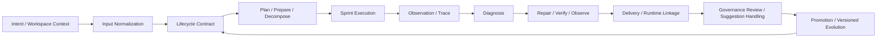
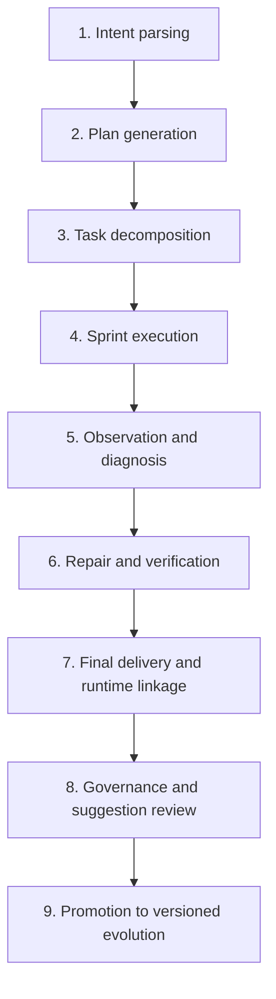
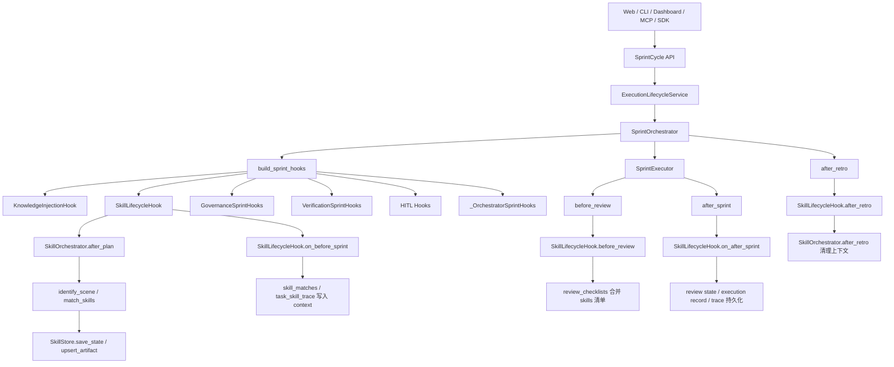

# SprintCycle System Overview / 系统总览

This document is a current snapshot of the system based on the latest implementation in the repository.
本文档基于仓库最新实现生成，作为系统当前快照使用。

---

## English

### 1. What SprintCycle is

SprintCycle is a contract-driven lifecycle orchestration platform that connects the full loop from Web request intake to final delivery, runtime linkage, governance, and versioned evolution.

For web-platform initiated work, the system is designed to complete the whole chain stably for both self-evolution tasks and user project optimization tasks:

**Web Request → Normalize → Plan → Prepare → Decompose → Execute → Observe → Diagnose → Repair → Deliver → Link Runtime → Govern Suggestions → Promote Versioned Evolution**

The current implementation centers on a public facade plus workflow-specific application services. The public API normalizes requests, coordinates the lifecycle contract, and routes work to the appropriate services. The services own the actual workflow logic, repair loops, governance decisions, observability evidence, and version promotion.

### 2. Architecture diagram

```mermaid
graph TD
  U[Users / CLI / Dashboard / MCP / SDK] --> A[SprintCycle API]
  A --> E[ExecutionLifecycleService]
  A --> G[GovernanceOrchestrationService]
  A --> S[SuggestionApplicationService]
  A --> O[ObservabilityService]
  A --> P[PlatformSummaryService]
  A --> R[RepairOrchestrationService]
  A --> V[LifecycleEvolutionService]

  E --> OR[SprintOrchestrator]
  E --> EX[Execution Engine]
  E --> ST[Execution State / Store]
  E --> RR[Runtime Registry]
  E --> HB[Execution Event Backend]
  E --> H[Hook Registry]

  G --> GF[GovernanceFacade]
  G --> AG[ArchGuard / Governance Checks]
  G --> H

  S --> SF[SuggestionFacade]
  S --> GV[Governance Facade]
  S --> H

  O --> OB[Observability Facade]
  O --> TR[Trace / Replay Payloads]

  R --> DI[Diagnose / Repair / Verify / Observe]
  V --> PC[Promotion Policy]
  V --> VR[SQLite Version Registry]
  V --> MS[Version Manifest / Active Pointer]

  P --> DV[Dashboard Views]
  P --> WV[Workbench / Platform Views]
```



### 3. Data flow diagram



### 4. Processing flow diagram



### 5. Core end-to-end flow

The system is designed around the following lifecycle:

1. **Intent parsing**
2. **Plan generation**
3. **Task decomposition**
4. **Sprint execution**
5. **Observation and diagnosis**
6. **Repair and verification**
7. **Final delivery**
8. **Runtime linkage**
9. **Governance and suggestion review**
10. **Promotion to versioned evolution**

For web-triggered work, this lifecycle should remain stable regardless of whether the request starts as an internal self-evolution objective or as an external user project optimization request.

This is not a single monolithic pipeline inside one class. It is a set of connected capabilities distributed across the API, services, facades, execution engine, governance layer, observability layer, and evolution/versioning layer.

### 6. Lifecycle contract model

The latest implementation centers on a single authoritative lifecycle contract:

- **`LifecycleStateMachine`** defines canonical stages and transitions.
- **`LifecycleContract`** carries the state facts used by all services.
- **`final_snapshot`** captures the complete promotable end state of an iteration.
- **`validation_refs`** stores gate-relevant checks such as `final_snapshot`, `promotion_input_final_snapshot`, `versioned_evolution`, and audit markers.
- **Correlation data** links `execution_id`, `task_id`, `suggestion_id`, `runtime_id`, `version_id`, and `trace_id`.

### 7. Recovery and promotion model

SprintCycle now treats failure recovery and promotion as first-class lifecycle steps:

- Any failed or incomplete stage can route into a unified recovery path.
- Recovery is organized around `diagnose → repair → verify → observe`.
- `PromotionPolicy` only allows promotion when evidence is complete, the contract is in a promotable state, and the final snapshot is valid.
- Successful promotion writes a version artifact into the SQLite version registry.
- The version artifact keeps a reference to the final snapshot contract for auditability and rollback.

### 8. Runtime and governance linkage

Runtime, suggestion, governance, and promotion all share the same contract lineage:

- runtime evidence and deployment linkage are attached to the lifecycle contract;
- suggestion review outcomes are attached to the lifecycle contract;
- governance approval is attached to the lifecycle contract;
- promotion consumes the final snapshot and writes versioned evolution metadata back into the registry.

### 9. Target-state architecture roadmap mapped to current modules

The target state keeps the existing layered skeleton, but makes the full web-triggered lifecycle more explicit, more recoverable, and more governable. The key components remain the same:

- **AutoGPT** for deployment packaging, platform startup, and environment assembly
- **LangGraph** for execution-graph adaptation, with a top-level `IntentGraphRuntime` and per-sprint `SprintGraphRuntime` coordinating orchestration steps
- **Phoenix** for trace, replay, observability, and diagnosis
- **SprintCycle Core** for planning, execution coordination, repair governance, suggestion capture, and self-evolution

The recommended division of responsibility is:

- **SprintCycle Core as the control plane**: owns request normalization, lifecycle contracts, transitions, repair governance, and version promotion decisions
- **AutoGPT as the platform bootstrap layer**: owns startup and environment wiring, but not domain workflow rules
- **LangGraph as the execution-graph layer**: owns top-level intent orchestration and per-sprint execution flow (`Intent → Plan → Sprint Split → Dispatch → Finalize`, `Prepare → Execute → Observe → Repair → Finalize`), but not policy or governance decisions
- **Phoenix as the observability layer**: owns traces, replay, and diagnostics, but not execution control

This means the system should avoid parallel pipelines. Each component should connect through explicit adapters, facades, hooks, or registries so that one authoritative lifecycle remains in place.

#### 9.1 Current code modules and their target-state role

- **`sprintcycle/api.py`**
  - Thin public entry layer for CLI, dashboard, MCP, and SDK.
  - Normalizes requests, builds final snapshots, and delegates to services.
  - Target-state role: keep workflow logic out of the API and use it only for routing and result aggregation.

- **`sprintcycle/services/execution_lifecycle_service.py`**
  - Owns execution start, pre-run gating, runtime registration, observability event emission, replay, and execution detail reads.
  - Target-state role: execution lifecycle bridge from normalized intent to runtime execution.
  - Gap: richer stage transitions, repair handoff, and failure taxonomy.

- **`sprintcycle/orchestration/sprint_orchestrator.py`**
  - Owns release-plan expansion, sprint execution, sprint/task hooks, runtime event emission, and integration with LangGraph and Phoenix.
  - Target-state role: the main execution coordination engine for plan decomposition and sprint work.
  - Gap: make planning, preparation, and repair feedback boundaries more explicit.

- **`sprintcycle/services/governance_orchestration_service.py`**
  - Owns governance checks and governance read workflows.
  - Target-state role: policy gate for planning, review, and escalation.
  - Gap: connect governance outcomes more directly to repair, suggestion, and evolution.

- **`sprintcycle/services/suggestion_application_service.py`**
  - Owns suggestion review, approval, rejection, archive, replay attachment, and execution-event capture.
  - Target-state role: converts execution feedback into governed suggestion assets.
  - Gap: standardize suggestion quality, deduplication, and promotion criteria.

- **`sprintcycle/services/observability_service.py`**
  - Owns trace, replay, event read, execution detail assembly, and audit payload generation.
  - Target-state role: diagnostic and replay surface for failures, repairs, and execution history.
  - Gap: continue refining phase timing and structured failure categories.

- **`sprintcycle/services/repair_orchestration_service.py`**
  - Owns unified recovery routing and the `diagnose → repair → verify → observe` loop.
  - Target-state role: centralized recovery controller that feeds the same contract back into the lifecycle.

- **`sprintcycle/services/promotion_policy.py`**
  - Owns promotion gating for final snapshot completeness, runtime health, governance approval, and trace evidence.
  - Target-state role: hard gate for version promotion.

- **`sprintcycle/services/lifecycle_evolution_service.py`**
  - Owns lifecycle contract construction, promotion evaluation, promotion execution, and version artifact registration.
  - Target-state role: bridge from final snapshot to versioned evolution.

- **`sprintcycle/versioning/sqlite_registry.py`**
  - Owns version registration, active version pointers, and manifest indexing.
  - Target-state role: version archive and pointer manager for promoted evolutions.

- **`sprintcycle/results.py`**
  - Owns unified result models.
  - Includes `FinalSnapshotResult`, `FinalSnapshotVersionSummary`, and `EvolutionOverviewResult`.
  - Target-state role: the stable output schema for API, CLI, Dashboard, and SDK consumers.

- **`sprintcycle/execution/skills.py`**, **`sprintcycle/execution/skill_store.py`**, **`sprintcycle/execution/skill_models.py`**, **`sprintcycle/execution/hooks/skill_hooks.py`**
  - Own scene identification, skill matching, skill injection state, persistent records, and sprint lifecycle hooks for skills.
  - Target-state role: an execution-time capability layer that can enrich planning, execution, review, and retro with scene-specific knowledge from the OpenClaw skill source.
  - Gap: formalize promotion criteria for skill artifacts, unify skill provenance with lifecycle contracts, and make skill activation more visible in read-side summaries.

- **`sprintcycle/infrastructure/integrations/langgraph/`**
  - LangGraph runtime and graph construction adapters.
  - `IntentGraphRuntime` handles top-level intent orchestration, and `SprintGraphRuntime` handles per-sprint execution orchestration.
  - Target-state role: execution-graph adapter, not domain owner.

- **`sprintcycle/integrations/phoenix/`**
  - Phoenix runtime, trace runtime, and exporter adapters.
  - Target-state role: observability adapter, not workflow controller.

- **`sprintcycle/evolution/`** and **`sprintcycle/versioning/`**
  - Own memory, intent evolution, knowledge capture, and version registry logic.
  - Target-state role: evolution and version growth layer that receives approved learnings.
  - Gap: stronger linkage from suggestions and governance outcomes into versioned evolution artifacts.

### 10. Skills subsystem and main lifecycle call chain

The skills subsystem is not a side executor. It is connected to the main lifecycle through `SprintOrchestrator` hooks and participates in the execution-time flow after planning, before execution, before review, and after retro.



Key responsibilities:

- **Main lifecycle** owns request intake, lifecycle contracts, execution coordination, result aggregation, delivery, and terminal state.
- **Skills subsystem** owns scene recognition, skill matching, skill injection, review checklist enrichment, skill evidence recording, and retro cleanup.
- **`SkillStore`** persists skill artifacts, injection state, execution records, and traces as auditable evidence.
- **`SkillLifecycleHook`** attaches skill capability to sprint lifecycle nodes instead of bypassing the main orchestrator.

### 11. Skills and lifecycle contracts

The current `LifecycleContract` already covers execution, delivery, runtime, governance, evolution, suggestion, recovery, validation, and final snapshot fields. The skills subsystem currently enters the system via hooks and context/state, and its provenance is not yet fully standardized as a first-class lifecycle contract field.

This means:

- skill execution facts already exist in runtime context and persistent storage;
- however, skill provenance, match rationale, review impact, and promotion results are not yet fully written back into the unified lifecycle contract;
- if you want stronger observability, consider adding skill summaries to the contract extension fields.

### 12. Target-state maturity roadmap

- **P0**: unify intent entry, lifecycle states, execution events, and delivery objects so every web-started task can complete the minimum closed loop without ambiguous completion.
- **P1**: separate planning from preparation, add diagnosis-grade observability, introduce controlled repair actions, and connect runtime/deployment feedback into the same lifecycle.
- **P2**: version every evolution step, capture reusable knowledge, optimize policies from feedback, and promote improvements only through governed rollout.

### 13. Current maturity summary

From the latest implementation perspective, the platform is no longer a loose set of features. It now has the shape of a real lifecycle-driven system with shared state, repair closures, governance gating, runtime linkage, final snapshots, and evolution promotion.

The next maturity step is to keep tightening the same contract across all read and write paths, so the Web-initiated flow remains stable even under failure, retry, and promotion scenarios.

---

## 14. 中文补充 / Chinese supplement

### 14.1 目标成熟架构补充

这部分是在现有实现基础上补充的目标状态，重点解决“从 Web 发起后，系统稳定完成整个迭代链路”的问题。

#### 统一生命周期中枢

系统现在已经从“多个服务各自写状态”升级为“统一生命周期中枢驱动多域协同”。生命周期核心由三件事构成：

- **LifecycleStateMachine**：唯一阶段迁移规则来源
- **LifecycleContract**：唯一状态事实载体
- **Correlation Model**：唯一跨域关联方式

目标不是让每个服务都自己决定“当前处于哪个阶段”，而是让所有服务围绕同一份契约协作。

#### 目标状态机

```text
new → normalized → planned → prepared → decomposed → executing → observing → diagnosed → repairing → verifying → delivering → runtime_linked → governing → promotion_ready → promoted
```

终态：

```text
failed / aborted / cancelled / promoted
```

其中：

- `diagnosed → repairing → verifying → observing` 构成显式修复闭环
- `delivering → runtime_linked → governing → promotion_ready → promoted` 构成交付到版本晋升闭环

#### 事件与关联模型

建议所有事件统一字段：

- `event_id`
- `execution_id`
- `request_id`
- `task_id`
- `suggestion_id`
- `runtime_id`
- `version_id`
- `trace_id`
- `stage`
- `status`
- `payload`
- `root_cause`
- `evidence_ref`

这样可以把执行、观测、建议、运行时、版本晋升串成同一条证据链。

#### 修复闭环

修复不应只是“标记可修复”，而应成为一个显式编排节点：

```text
Diagnose → Repair → Verify → Observe
```

要求：

- 修复后必须重新观测
- 修复结果必须回写 lifecycle contract
- 修复闭环未关闭时，不允许进入晋升门禁

#### 版本晋升门禁

版本晋升必须依赖证据链和运行时健康，建议至少满足：

- execution 已完成
- trace / observability 证据完整
- runtime healthy
- suggestion approved
- repair 已闭环
- governance 通过
- final snapshot 有效

否则 promotion 应被阻止。

#### 文档补充建议

如果后续继续写文档，建议在 `SYSTEM_OVERVIEW.md` 里新增以下小节：

- **Unified Lifecycle Contract**
- **Correlation Model**
- **Repair Closed Loop**
- **Promotion Policy Gate**
- **Runtime Handoff and Verification**
- **Suggestion-to-Version Provenance**
- **Final Snapshot and Version Registry**

#### 可直接对外表述的系统定位

可以把 SprintCycle 定位为：

> 一个以统一生命周期契约为核心、以事件和证据链为纽带、以修复闭环和晋升门禁为保障的 Web 端到端迭代编排平台。

---

## 15. Final note

SprintCycle is now implemented with a much clearer contract-first shape: a single lifecycle contract flows through execution, recovery, governance, promotion, and versioning. The remaining work is mostly about tightening schemas, audit timelines, and dashboard ergonomics rather than changing the fundamental architecture.
