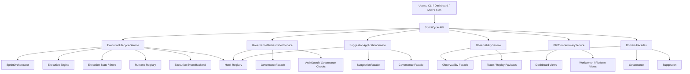
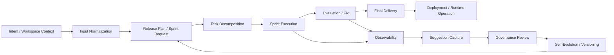
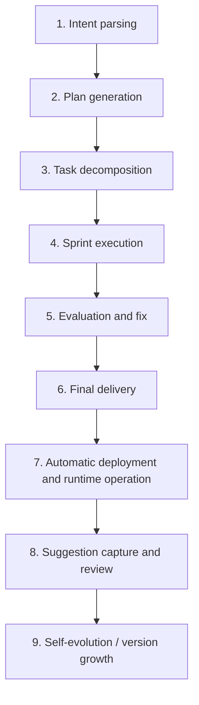
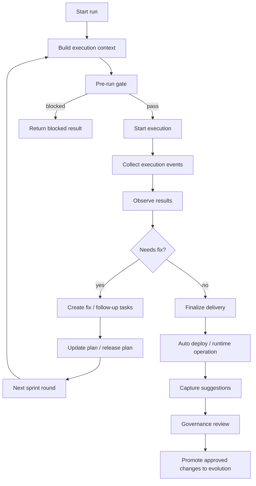
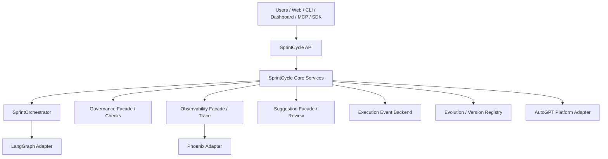
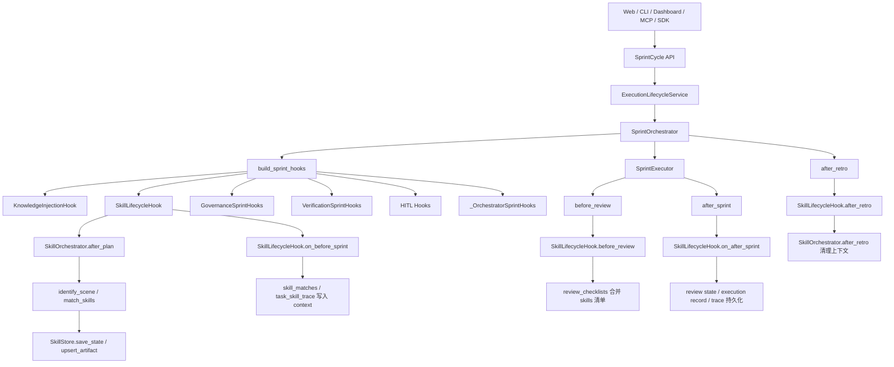

# SprintCycle System Overview / 系统总览

This document is a current snapshot of the system based on the latest implementation in the repository.
本文档基于仓库最新实现生成，作为系统当前快照使用。

---

## English

### 1. What SprintCycle is

SprintCycle is an orchestration platform that connects the full loop from intent understanding to final delivery, deployment, governance, suggestion handling, observability, and evolution.

For web-platform initiated work, the system is expected to complete the full chain stably for both self-evolution tasks and user project optimization tasks: intent parsing → plan generation → task decomposition → sprint execution → evaluation and fix → final delivery → automatic deployment and runtime operation → suggestion capture and review → self-evolution.

The current implementation centers on a public facade plus workflow-specific application services. The public API coordinates, normalizes, and routes requests; the services own the actual workflow logic.

### 2. Architecture diagram



### 3. Data flow diagram



### 4. Processing flow diagram



### 5. Core end-to-end flow

The system is designed around the following lifecycle:

1. **Intent parsing**
2. **Plan generation**
3. **Task decomposition**
4. **Sprint execution**
5. **Evaluation and fix**
6. **Final delivery**
7. **Automatic deployment and runtime operation**
8. **Suggestion capture and review**
9. **Self-evolution / version growth**

For web-triggered work, this lifecycle should remain stable regardless of whether the request starts as an internal self-evolution objective or as an external user project optimization request.

This is not a single monolithic pipeline inside one class. It is a set of connected capabilities distributed across the API, services, facades, execution engine, governance layer, observability layer, and evolution/versioning layer.

### 6. Core multi-round sprint execution flow

A single sprint run is usually only one round in a longer loop. The current implementation supports a repeated cycle of execution, feedback, and follow-up work, so that web-started tasks can continue through evaluation, repair, delivery, deployment, and evolution without breaking the chain.



### 7. Target-state architecture roadmap mapped to current modules

The target state keeps the existing layered skeleton, but makes the full web-triggered lifecycle more explicit, more recoverable, and more governable. The key components remain the same:

- **AutoGPT** for deployment packaging, platform startup, and environment assembly
- **LangGraph** for execution-graph adaptation, node orchestration, and step scheduling
- **Phoenix** for trace, replay, observability, and diagnosis
- **SprintCycle Core** for planning, execution coordination, repair, governance, suggestion capture, and self-evolution

The recommended division of responsibility is:

- **SprintCycle Core as the control plane**: owns request normalization, task context, lifecycle transitions, repair governance, and evolution/version decisions
- **AutoGPT as the platform bootstrap layer**: owns startup and environment wiring, but not domain workflow rules
- **LangGraph as the execution-graph layer**: owns how runnable steps are organized and executed, but not policy or governance decisions
- **Phoenix as the observability layer**: owns traces, replay, and diagnostics, but not execution control

This means the system should avoid parallel pipelines. Each component should connect through explicit adapters, facades, hooks, or registries so that one authoritative lifecycle remains in place.

#### 7.1 Current code modules and their target-state role

- **`sprintcycle/api.py`**
  - Thin public entry layer for CLI, dashboard, MCP, and SDK.
  - Normalizes requests and delegates to services.
  - Target-state role: keep workflow logic out of the API and use it only for routing and result aggregation.

- **`sprintcycle/services/execution_lifecycle_service.py`**
  - Owns execution start, pre-run gating, runtime registration, observability event emission, replay, and execution detail reads.
  - Target-state role: execution lifecycle bridge from normalized intent to runtime execution.
  - Gap: richer stage transitions, repair handoff, and failure taxonomy.

- **`sprintcycle/orchestration/sprint_orchestrator.py`**
  - Owns release-plan expansion, sprint execution, sprint/task hooks, runtime event emission, and integration with LangGraph and Phoenix.
  - Target-state role: the main execution coordination engine for plan decomposition and sprint work.
  - Gap: make planning, preparation, and repair feedback boundaries more explicit.

- **`sprintcycle/services/governance_orchestration_service.py`**
  - Owns governance checks and governance read workflows.
  - Target-state role: policy gate for planning, review, and escalation.
  - Gap: connect governance outcomes more directly to repair, suggestion, and evolution.

- **`sprintcycle/services/suggestion_application_service.py`**
  - Owns suggestion review, approval, rejection, archive, replay attachment, and execution-event capture.
  - Target-state role: converts execution feedback into governed suggestion assets.
  - Gap: standardize suggestion quality, deduplication, and promotion criteria.

- **`sprintcycle/services/observability_service.py`**
  - Owns trace, replay, event read, and execution detail assembly.
  - Target-state role: diagnostic and replay surface for failures, repairs, and execution history.
  - Gap: add root-cause tags, phase timing, and structured failure categories.

- **`sprintcycle/services/platform_summary_service.py`**
  - Owns dashboard/platform-facing summary payloads, including overview, spec, console, fitness, deploy, governance, and fix views.
  - Target-state role: delivery and summary aggregation for human-facing workbenches.
  - Gap: include explicit deployment/runtime handoff and evolution readiness indicators.

- **`sprintcycle/governance/facade.py`** and **`sprintcycle/governance/suggestion/facade.py`**
  - Domain-facing governance and suggestion coordination points.
  - Target-state role: stable compatibility and coordination layer underneath the services.

- **`sprintcycle/observability/facade.py`**
  - Domain-facing observability coordination point.
  - Target-state role: event, trace, and replay adapter behind the read-side service.

- **`sprintcycle/deployment/runtime_registry.py`** and runtime adapters
  - Own runtime registration and environment-specific integration.
  - Target-state role: deployment/runtime linkage after delivery.
  - Gap: make post-delivery handoff and verification explicit.

- **`sprintcycle/execution/skills.py`**, **`sprintcycle/execution/skill_store.py`**, **`sprintcycle/execution/skill_models.py`**, **`sprintcycle/execution/hooks/skill_hooks.py`**
  - Own scene identification, skill matching, skill injection state, persistent records, and sprint lifecycle hooks for skills.
  - Target-state role: an execution-time capability layer that can enrich planning, execution, review, and retro with scene-specific knowledge from the OpenClaw skill source.
  - Gap: formalize promotion criteria for skill artifacts, unify skill provenance with lifecycle contracts, and make skill activation more visible in read-side summaries.

- **`sprintcycle/integrations/langgraph/`**
  - LangGraph runtime and graph construction adapters.
  - Target-state role: execution-graph adapter, not domain owner.

- **`sprintcycle/integrations/phoenix/`**
  - Phoenix runtime, trace runtime, and exporter adapters.
  - Target-state role: observability adapter, not workflow controller.

- **`sprintcycle/evolution/`** and **`sprintcycle/versioning/`**
  - Own memory, intent evolution, knowledge capture, and version registry logic.
  - Target-state role: evolution and version growth layer that receives approved learnings.
  - Gap: stronger linkage from suggestions and governance outcomes into versioned evolution artifacts.

#### 7.2 Target-state end-to-end chain


#### 7.3 Target-state component boundary map



#### 7.4 Skills 子系统与主生命周期的调用链

skills 子系统不是独立于主生命周期之外的旁路，而是通过 `SprintOrchestrator` 的 sprint 钩子挂入执行链路，在“计划后、执行前、评审前、复盘后”几个关键节点参与上下文增强与证据沉淀。



这一调用链对应的核心职责如下：

- **主生命周期** 负责请求进入、生命周期契约、执行编排、结果汇总、交付与状态收束。
- **skills 子系统** 负责场景识别、skill 匹配、skill 注入、review checklist 增强、技能证据记录和复盘清理。
- **`SkillStore`** 负责 skill artifact、注入状态、执行记录与 trace 的落盘，形成可追溯证据链。
- **`SkillLifecycleHook`** 负责把 skill 能力接到 sprint 级别的生命周期节点上，而不是绕开主编排器单独执行。

#### 7.5 Skills 与生命周期契约的关系

当前 `LifecycleContract` 已经覆盖了 execution、delivery、runtime、governance、evolution、suggestion 等主链路字段；skills 子系统在实现上主要通过 hook 和 context 方式接入，尚未成为 contract 的一级字段。

这意味着：

- skills 的执行事实已经进入运行时上下文与持久化存储；
- 但 skills 的 provenance、命中理由、review 影响和晋升结果，还没有完全标准化地回写到统一生命周期契约中；
- 后续如果要提升可观测性，建议把 `skill_matches`、`task_skill_trace`、`skill_review_checklists` 和 `skill_artifacts` 的摘要纳入生命周期 contract 的扩展字段。

#### 7.6 Target-state maturity roadmap

- **P0**: unify intent entry, lifecycle states, execution events, and delivery objects so every web-started task can complete the minimum closed loop without ambiguous completion.
- **P1**: separate planning from preparation, add diagnosis-grade observability, introduce controlled repair actions, and connect runtime/deployment feedback into the same lifecycle.
- **P2**: version every evolution step, capture reusable knowledge, optimize policies from feedback, and promote improvements only through governed rollout.

#### 7.7 P0 implementation plan

P0 is the stabilization phase. The goal is not new capability breadth, but a reliable minimum closed loop.

- **`sprintcycle/api.py`**
  - Keep request normalization thin and consistent across CLI, dashboard, MCP, and SDK.
  - Ensure all web-initiated work enters a single intent/task shape.

- **`sprintcycle/services/execution_lifecycle_service.py`**
  - Introduce explicit lifecycle states for normalized, planned, prepared, executing, observing, delivering, and completed.
  - Return structured failure results instead of ambiguous partial outcomes.

---

## Chinese / 中文

### 8. 目标成熟架构补充

这部分是在现有实现基础上补充的目标状态，重点解决“从 Web 发起后，系统稳定完成整个迭代链路”的问题。

#### 8.1 统一生命周期中枢

系统现在已经逐步从“多个服务各自写状态”升级为“统一生命周期中枢驱动多域协同”。建议把生命周期核心定义成三件事：

- **LifecycleStateMachine**：唯一阶段迁移规则来源
- **LifecycleContract**：唯一状态事实载体
- **Correlation Model**：唯一跨域关联方式

目标不是让每个服务都自己决定“当前处于哪个阶段”，而是让所有服务都围绕同一份契约协作。

#### 8.2 目标状态机

建议采用如下标准阶段：

```text
new → normalized → planned → prepared → decomposed → executing → observing → diagnosed → repairing → verifying → delivering → runtime_linked → governing → promotion_ready → promoted
```

终态：

```text
failed / aborted / cancelled / promoted
```

其中：

- `diagnosed → repairing → verifying → observing` 构成显式修复闭环
- `delivering → runtime_linked → governing → promotion_ready → promoted` 构成交付到版本晋升闭环

#### 8.3 事件与关联模型

建议所有事件统一字段：

- `event_id`
- `execution_id`
- `request_id`
- `task_id`
- `suggestion_id`
- `runtime_id`
- `version_id`
- `trace_id`
- `stage`
- `status`
- `payload`
- `root_cause`
- `evidence_ref`

这样可以把执行、观测、建议、运行时、版本晋升串成同一条证据链。

#### 8.4 修复闭环

修复不应只是“标记可修复”，而应成为一个显式编排节点：

```text
Diagnose → Repair → Verify → Observe
```

要求：

- 修复后必须重新观测
- 修复结果必须回写 lifecycle contract
- 修复闭环未关闭时，不允许进入晋升门禁

#### 8.5 版本晋升门禁

版本晋升必须依赖证据链和运行时健康，建议至少满足：

- execution 已完成
- trace / observability 证据完整
- runtime healthy
- suggestion approved
- repair 已闭环
- governance 通过

否则 promotion 应被阻止。

#### 8.6 文档补充建议

如果后续继续写文档，建议在 `SYSTEM_OVERVIEW.md` 里新增以下小节：

- **Unified Lifecycle Contract**
- **Correlation Model**
- **Repair Closed Loop**
- **Promotion Policy Gate**
- **Runtime Handoff and Verification**
- **Suggestion-to-Version Provenance**

#### 8.7 可直接对外表述的系统定位

可以把 SprintCycle 定位为：

> 一个以统一生命周期契约为核心、以事件和证据链为纽带、以修复闭环和晋升门禁为保障的 Web 端到端迭代编排平台。

---

## 9. Current maturity summary

From the latest implementation perspective, the platform is no longer a loose set of features. It now has the shape of a real lifecycle-driven system with shared state, repair closures, governance gating, runtime linkage, and evolution promotion.

The next maturity step is to keep tightening the same contract across all read and write paths, so the Web-initiated flow remains stable even under failure, retry, and promotion scenarios.
