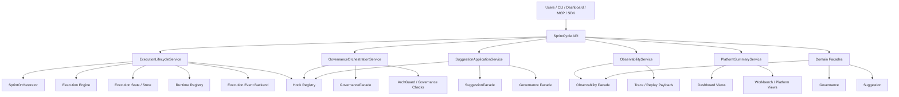
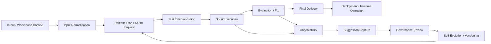
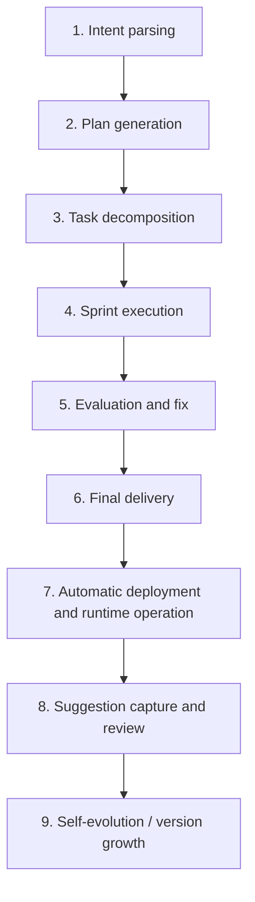
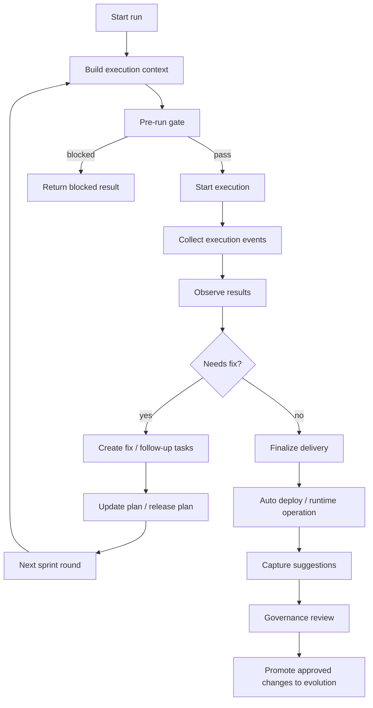
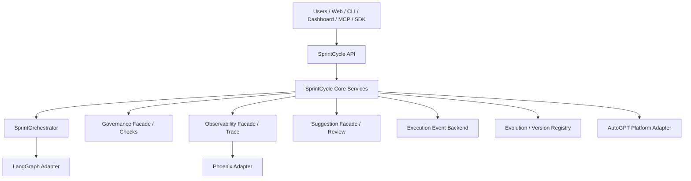
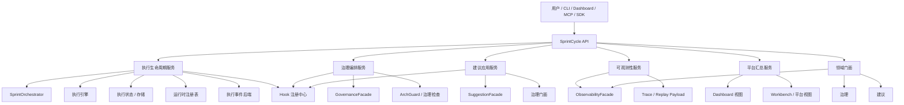
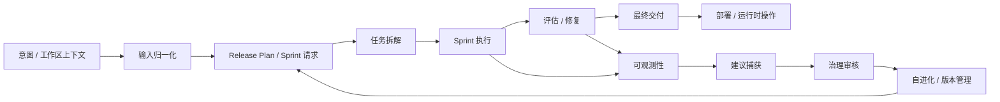
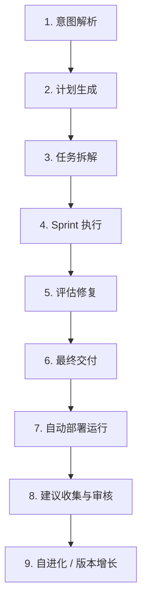
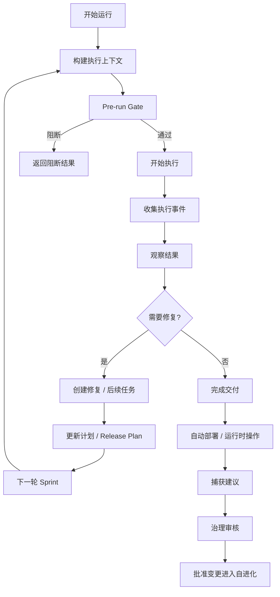

# SprintCycle System Overview / 系统总览

This document is a current snapshot of the system based on the latest implementation in the repository.
本文档基于仓库最新实现生成，作为系统当前快照使用。

---

## English

### 1. What SprintCycle is

SprintCycle is an orchestration platform that connects the full loop from intent understanding to final delivery, deployment, governance, suggestion handling, observability, and evolution.

For web-platform initiated work, the system is expected to complete the full chain stably for both self-evolution tasks and user project optimization tasks: intent parsing → plan generation → task decomposition → sprint execution → evaluation and fix → final delivery → automatic deployment and runtime operation → suggestion capture and review → self-evolution.

The current implementation centers on a public facade plus workflow-specific application services. The public API coordinates, normalizes, and routes requests; the services own the actual workflow logic.

### 2. Architecture diagram

### 3. Data flow diagram

### 4. Processing flow diagram

### 5. Core end-to-end flow

The system is designed around the following lifecycle:

1. **Intent parsing**
2. **Plan generation**
3. **Task decomposition**
4. **Sprint execution**
5. **Evaluation and fix**
6. **Final delivery**
7. **Automatic deployment and runtime operation**
8. **Suggestion capture and review**
9. **Self-evolution / version growth**

For web-triggered work, this lifecycle should remain stable regardless of whether the request starts as an internal self-evolution objective or as an external user project optimization request.

This is not a single monolithic pipeline inside one class. It is a set of connected capabilities distributed across the API, services, facades, execution engine, governance layer, observability layer, and evolution/versioning layer.

### 6. Core multi-round sprint execution flow

A single sprint run is usually only one round in a longer loop. The current implementation supports a repeated cycle of execution, feedback, and follow-up work, so that web-started tasks can continue through evaluation, repair, delivery, deployment, and evolution without breaking the chain.

### 7. Target-state architecture roadmap mapped to current modules

The target state keeps the existing layered skeleton, but makes the full web-triggered lifecycle more explicit, more recoverable, and more governable. The key components remain the same:

- **AutoGPT** for deployment packaging, platform startup, and environment assembly
- **LangGraph** for execution-graph adaptation, node orchestration, and step scheduling
- **Phoenix** for trace, replay, observability, and diagnosis
- **SprintCycle Core** for planning, execution coordination, repair, governance, suggestion capture, and self-evolution

The recommended division of responsibility is:

- **SprintCycle Core as the control plane**: owns request normalization, task context, lifecycle transitions, repair governance, and evolution/version decisions
- **AutoGPT as the platform bootstrap layer**: owns startup and environment wiring, but not domain workflow rules
- **LangGraph as the execution-graph layer**: owns how runnable steps are organized and executed, but not policy or governance decisions
- **Phoenix as the observability layer**: owns traces, replay, and diagnostics, but not execution control

This means the system should avoid parallel pipelines. Each component should connect through explicit adapters, facades, hooks, or registries so that one authoritative lifecycle remains in place.

#### 7.1 Current code modules and their target-state role

- **`sprintcycle/api.py`**
  - Thin public entry layer for CLI, dashboard, MCP, and SDK.
  - Normalizes requests and delegates to services.
  - Target-state role: keep workflow logic out of the API and use it only for routing and result aggregation.

- **`sprintcycle/services/execution_lifecycle_service.py`**
  - Owns execution start, pre-run gating, runtime registration, observability event emission, replay, and execution detail reads.
  - Target-state role: execution lifecycle bridge from normalized intent to runtime execution.
  - Gap: richer stage transitions, repair handoff, and failure taxonomy.

- **`sprintcycle/orchestration/sprint_orchestrator.py`**
  - Owns release-plan expansion, sprint execution, sprint/task hooks, runtime event emission, and integration with LangGraph and Phoenix.
  - Target-state role: the main execution coordination engine for plan decomposition and sprint work.
  - Gap: make planning, preparation, and repair feedback boundaries more explicit.

- **`sprintcycle/services/governance_orchestration_service.py`**
  - Owns governance checks and governance read workflows.
  - Target-state role: policy gate for planning, review, and escalation.
  - Gap: connect governance outcomes more directly to repair, suggestion, and evolution.

- **`sprintcycle/services/suggestion_application_service.py`**
  - Owns suggestion review, approval, rejection, archive, replay attachment, and execution-event capture.
  - Target-state role: converts execution feedback into governed suggestion assets.
  - Gap: standardize suggestion quality, deduplication, and promotion criteria.

- **`sprintcycle/services/observability_service.py`**
  - Owns trace, replay, event read, and execution detail assembly.
  - Target-state role: diagnostic and replay surface for failures, repairs, and execution history.
  - Gap: add root-cause tags, phase timing, and structured failure categories.

- **`sprintcycle/services/platform_summary_service.py`**
  - Owns dashboard/platform-facing summary payloads, including overview, spec, console, fitness, deploy, governance, and fix views.
  - Target-state role: delivery and summary aggregation for human-facing workbenches.
  - Gap: include explicit deployment/runtime handoff and evolution readiness indicators.

- **`sprintcycle/governance/facade.py`** and **`sprintcycle/governance/suggestion/facade.py`**
  - Domain-facing governance and suggestion coordination points.
  - Target-state role: stable compatibility and coordination layer underneath the services.

- **`sprintcycle/observability/facade.py`**
  - Domain-facing observability coordination point.
  - Target-state role: event, trace, and replay adapter behind the read-side service.

- **`sprintcycle/deployment/runtime_registry.py`** and runtime adapters
  - Own runtime registration and environment-specific integration.
  - Target-state role: deployment/runtime linkage after delivery.
  - Gap: make post-delivery handoff and verification explicit.

- **`sprintcycle/integrations/langgraph/`**
  - LangGraph runtime and graph construction adapters.
  - Target-state role: execution-graph adapter, not domain owner.

- **`sprintcycle/integrations/phoenix/`**
  - Phoenix runtime, trace runtime, and exporter adapters.
  - Target-state role: observability adapter, not workflow controller.

- **`sprintcycle/evolution/`** and **`sprintcycle/versioning/`**
  - Own memory, intent evolution, knowledge capture, and version registry logic.
  - Target-state role: evolution and version growth layer that receives approved learnings.
  - Gap: stronger linkage from suggestions and governance outcomes into versioned evolution artifacts.

#### 7.2 Target-state end-to-end chain

#### 7.3 Target-state component boundary map

#### 7.4 Target-state maturity roadmap

- **P0**: unify intent entry, lifecycle states, execution events, and delivery objects so every web-started task can complete the minimum closed loop without ambiguous completion.
- **P1**: separate planning from preparation, add diagnosis-grade observability, introduce controlled repair actions, and connect runtime/deployment feedback into the same lifecycle.
- **P2**: version every evolution step, capture reusable knowledge, optimize policies from feedback, and promote improvements only through governed rollout.

#### 7.5 P0 implementation plan

P0 is the stabilization phase. The goal is not new capability breadth, but a reliable minimum closed loop.

- **`sprintcycle/api.py`**
  - Keep request normalization thin and consistent across CLI, dashboard, MCP, and SDK.
  - Ensure all web-initiated work enters a single intent/task shape.

- **`sprintcycle/services/execution_lifecycle_service.py`**
  - Introduce explicit lifecycle states for normalized, planned, prepared, executing, observing, delivering, and completed.
  - Return structured failure results instead of ambiguous partial outcomes.

- **`sprintcycle/orchestration/sprint_orchestrator.py`**
  - Preserve a single execution path for plan expansion, execution, and finalization.
  - Make the transition from planned work to runnable work explicit.

- **`sprintcycle/services/observability_service.py`**
  - Capture the minimum event set for start, finish, failure, retry, and delivery.
  - Ensure every run can be inspected after completion.

- **`sprintcycle/services/platform_summary_service.py`**
  - Produce structured delivery summaries with artifacts, status, and next-step context.

- **`sprintcycle/deployment/runtime_registry.py`** and runtime adapters
  - Keep runtime linkage available for delivered outputs, even if the initial behavior is read-only or advisory.

- **Success criteria for P0**
  - A web-started task can reach a clear completed or failed state.
  - No stage depends on hidden side effects.
  - Results are structured enough for downstream use.

#### 7.6 P1 implementation plan

P1 is the control-and-recovery phase. The goal is to make the chain observable enough to repair and continue.

- **`sprintcycle/services/governance_orchestration_service.py`**
  - Connect planning and review outcomes to explicit repair or escalation paths.
  - Separate planning gate results from review gate results.

- **`sprintcycle/orchestration/sprint_orchestrator.py`**
  - Make planning, preparation, execution, and post-run repair boundaries explicit.
  - Treat repair as a controlled follow-up action, not a side effect inside execution.

- **`sprintcycle/services/observability_service.py`**
  - Add phase timing, failure taxonomy, and root-cause tags.
  - Support diagnosis and replay for failed or repaired runs.

- **`sprintcycle/services/suggestion_application_service.py`**
  - Standardize suggestion capture from failures, fixes, and human feedback.
  - Add deduplication and promotion criteria before a suggestion becomes actionable.

- **`sprintcycle/services/platform_summary_service.py`**
  - Include runtime/deployment handoff indicators and repair status in summaries.

- **`sprintcycle/integrations/langgraph/`** and **`sprintcycle/integrations/phoenix/`**
  - Keep both as adapters that enrich execution and observability without owning the lifecycle.

- **Success criteria for P1**
  - Failures can be classified and routed to the correct response.
  - Repair actions are explicit, limited, and observable.
  - Delivery can be linked back to runtime or deployment state.

#### 7.7 P2 implementation plan

P2 is the evolution-and-governance phase. The goal is to let the system improve without losing control.

- **`sprintcycle/evolution/`** and **`sprintcycle/versioning/`**
  - Version every approved improvement or learned pattern.
  - Store reusable knowledge with scope, constraints, and rollback information.

- **`sprintcycle/governance/facade.py`** and **`sprintcycle/governance/suggestion/facade.py`**
  - Treat suggestion promotion as a governed decision path.
  - Only approved outcomes should feed version growth.

- **`sprintcycle/services/governance_orchestration_service.py`**
  - Close the loop from suggestion review to versioned evolution input.

- **`sprintcycle/services/observability_service.py`**
  - Preserve traces and replay payloads as the evidence layer for evolution decisions.

- **`sprintcycle/services/platform_summary_service.py`**
  - Surface evolution readiness and rollout status in human-facing summaries.

- **Success criteria for P2**
  - Every evolution step is versioned and reviewable.
  - Knowledge can be reused without becoming an uncontrolled parallel policy layer.
  - Feedback improves future runs only through governed rollout.

#### 7.8 Module-level implementation guidance

- **API layer**: keep only request normalization, compatibility, routing, and result assembly.
- **Execution lifecycle service**: strengthen stage transitions, failure classification, and repair handoff.
- **Sprint orchestrator**: make plan preparation, execution, and post-run finalization more explicit.
- **Governance service**: route planning and review outcomes into repair, suggestion, and evolution decisions.
- **Suggestion service**: add structured capture, deduplication, and promotion criteria.
- **Observability service**: expand trace/replay payloads for diagnosis and repair analysis.
- **Platform summary service**: include delivery, deployment, and evolution readiness indicators.
- **Integration adapters**: keep LangGraph and Phoenix as capability adapters that support the core flow.
- **Evolution/versioning**: make approved changes, memory, and version growth the governed tail of the chain.

#### 7.9 What this means for the target state

The target state is already visible in the codebase as a set of services and adapters. The remaining work is mainly to:

1. make the lifecycle stages explicit,
2. make failure and repair behavior first-class,
3. make delivery-to-runtime handoff measurable, and
4. make suggestion/evolution promotion versioned and reviewable.

### 8. Intent parsing

Intent parsing turns user goals, workspace context, and existing project state into a structured starting point for execution.

Current implementation areas involved in this stage include:

- intent and memory handling in the evolution layer
- prompt / intent support utilities
- public API entry points that normalize input before delegation

Intent parsing is not implemented as a separate standalone monolith. It is distributed across the intent-related helpers and the public orchestration layer.

### 8. Plan generation

Plan generation converts the parsed intent into an executable release plan or sprint-oriented execution structure.

Current implementation areas involved in this stage include:

- execution planning utilities
- release plan parsing and orchestration paths
- sprint orchestration entry points exposed through `SprintCycle`
- downstream execution engine adapters

The public API coordinates plan-related inputs and delegates actual planning behavior to the orchestrator and execution stack.

### 9. Task decomposition

Task decomposition breaks a higher-level plan into workable execution units that can be run by sprint execution.

Current implementation areas involved in this stage include:

- task and sprint planning models
- execution planners and builders
- orchestrator logic that prepares runnable execution units
- runtime and state helpers that persist execution structure

Task decomposition is part of the execution workflow rather than a separate user-facing product surface.

### 10. Sprint execution

Sprint execution is the runtime path that actually runs the planned work.

Current implementation areas involved in this stage include:

- `SprintCycle.run(...)` as the public entry point
- `ExecutionLifecycleService` for execution startup and lifecycle coordination
- `SprintOrchestrator` and execution engine components for actual run behavior
- execution state, event backend, rollback, cache, and runtime registry helpers

Typical responsibilities in this stage include:

- creating an execution context
- applying pre-run gates
- starting execution runs
- updating execution state
- recording execution events
- exposing execution details and replay data

### 11. Evaluation and fix

After or during execution, the system can evaluate results and surface fix-oriented views and workflows.

Current implementation areas involved in this stage include:

- observability trace and replay data
- dashboard views for fix / fitness / execution status
- governance and policy checks that can feed back into execution quality
- report and summary helpers in the service layer

Evaluation is not a single isolated engine. It is a collection of read-side summaries and workflow feedback paths.

### 12. Final delivery

Final delivery represents the point where execution output becomes a usable result for the workspace, dashboard, or downstream automation. For the requested end-to-end chain, this is the point where the system must hand off cleanly into automatic deployment, runtime operation, and the next suggestion/evolution cycle.

Current implementation areas involved in this stage include:

- execution result objects
- platform and dashboard summary services
- deployment-related helpers and views
- observability payloads for final inspection

In the current codebase, “final delivery” is best understood as the combination of successful execution result materialization, summary generation, and downstream presentation.

### 13. Automatic deployment and runtime operation

SprintCycle also includes deployment-oriented and runtime-oriented support.

Current implementation areas involved in this stage include:

- deployment helpers
- runtime registry management
- dashboard deploy views
- compose and sandbox utilities
- integration adapters for environment-specific runtime behavior

The public API coordinates these capabilities but does not own the deployment internals.

### 14. Suggestions

Suggestion handling is a first-class governance workflow.

Current capabilities include:

- review
- approve
- reject
- archive
- promotion to HITL
- replay attachment
- capture of execution events into suggestion records

Current implementation centers on `SuggestionApplicationService`, `SuggestionFacade`, and the governance suggestion modules.

### 15. Self-evolution

SprintCycle includes evolution-oriented support for version growth, knowledge capture, and intent-driven iteration. In the web-platform chain, self-evolution is the tail of the same workflow that begins with intent parsing and planning, not a detached side path.

Current implementation areas involved in this stage include:

- version registry access
- evolution summary and index support
- memory store and knowledge repository integration
- evolution workflow helpers and controllers

Self-evolution is implemented as an explicit capability layer rather than as an implicit side effect of execution.

### 16. Governance and human-in-the-loop

Governance ensures that execution and suggestion flows can be checked, reviewed, and controlled.

Current implementation areas include:

- governance checks for planning and review gates
- pending / history / summary / request lookup
- suggestion review and approval flows
- HITL orchestration
- hook-based callbacks around governance actions

### 17. Observability

Observability is a separate read-side capability that keeps trace and replay concerns out of the main execution and governance workflows.

Current implementation areas include:

- event recording
- event listing
- trace payload generation
- replay payload generation
- execution detail views based on observability data

### 18. Hook and event protocol

The hook system is centralized in `sprintcycle/hooks.py`.

Current protocol:

- phases: `before`, `after`, `failed`
- policies: `fail_open`, `fail_closed`, `compensate`
- context objects: carry domain, action, subject, execution, project path, payload, metadata, and trace id
- result objects: can block, mutate, or annotate execution
- domain events: registered and emitted through the hook registry

Current hook domains include execution, suggestion, and governance.

### 19. Public API role

`SprintCycle` is the public coordination layer for CLI, dashboard, MCP, and SDK usage.

It is responsible for:

- initialization and dependency wiring
- parameter normalization
- thin cross-layer delegation
- result aggregation
- compatibility adapters when old behavior still needs to be supported

It is not responsible for owning the workflow rules themselves.

### 20. Main source-of-truth files

For the most accurate behavior, inspect these files first:

- `sprintcycle/api.py`
- `sprintcycle/hooks.py`
- `sprintcycle/services/execution_lifecycle_service.py`
- `sprintcycle/services/governance_orchestration_service.py`
- `sprintcycle/services/suggestion_application_service.py`
- `sprintcycle/services/observability_service.py`
- `sprintcycle/services/platform_summary_service.py`
- `sprintcycle/governance/facade.py`
- `sprintcycle/governance/suggestion/facade.py`
- `sprintcycle/observability/facade.py`
- `sprintcycle/orchestration/sprint_orchestrator.py`
- `sprintcycle/execution/`
- `sprintcycle/evolution/`

### 21. Chinese diagram summary

#### 架构图

#### 数据流图

#### 处理流程图

#### 完整的多轮 Sprint 执行流程图

---

## 中文

### 1. SprintCycle 是什么

SprintCycle 是一个编排平台，连接从意图理解、计划生成、任务拆解、Sprint 执行、评估修复、最终交付，到自动部署运行、建议处理、治理控制和自进化的完整闭环。

当前实现以“公共门面 + 具体工作流应用服务”为中心。公共 API 负责协调、归一化和路由；真正的工作流逻辑由各个 service 负责。

### 2. 核心端到端流程

系统围绕以下生命周期设计：

1. **意图解析**
2. **计划生成**
3. **任务拆解**
4. **Sprint 执行**
5. **评估修复**
6. **最终交付**
7. **自动部署运行**
8. **建议收集与审核**
9. **自进化 / 版本增长**

它不是一个写死在单个类里的大流水线，而是分布在 API、服务层、门面层、执行引擎、治理层、可观测性层和演化/版本管理层中的多个能力组合。

### 3. 意图解析

意图解析的目标，是把用户目标、工作区上下文和已有项目状态，转成一个可执行的起点。

当前参与这一阶段的实现主要包括：

- 演化层中的 intent 和 memory 处理
- prompt / intent 相关工具
- 公共 API 在分发前做输入归一化

意图解析并不是一个单独的大模块，而是分散在 intent 相关工具和公共编排层中。

### 4. 计划生成

计划生成会把解析后的意图转换成可执行的 release plan 或 sprint 执行结构。

当前参与这一阶段的实现主要包括：

- 执行规划工具
- release plan 的解析和编排路径
- 通过 `SprintCycle` 暴露的 sprint 编排入口
- 下游执行引擎适配器

公共 API 负责接收计划相关输入，并把真正的规划行为委派给 orchestrator 和执行栈。

### 5. 任务拆解

任务拆解会把高层计划拆成可执行单元，供 sprint 执行运行。

当前参与这一阶段的实现主要包括：

- task 和 sprint 的规划模型
- execution planners 和 builders
- 准备可运行执行单元的 orchestrator 逻辑
- 持久化执行结构的 runtime / state 辅助工具

任务拆解属于执行工作流的一部分，而不是单独对外暴露的产品表面。

### 6. Sprint 执行

Sprint 执行是实际运行计划工作的运行时路径。

当前参与这一阶段的实现主要包括：

- 作为公共入口的 `SprintCycle.run(...)`
- 负责执行启动与生命周期协调的 `ExecutionLifecycleService`
- 负责真实运行行为的 `SprintOrchestrator` 和执行引擎组件
- execution state、事件后端、回滚、缓存和运行时注册表辅助工具

这一阶段通常负责：

- 创建 execution context
- 应用 pre-run gate
- 启动执行
- 更新执行状态
- 记录执行事件
- 暴露执行详情与 replay 数据

### 7. 评估修复

执行完成后或执行过程中，系统可以对结果进行评估，并提供修复导向的视图和工作流。

当前参与这一阶段的实现主要包括：

- observability 的 trace / replay 数据
- dashboard 中的 fix / fitness / execution 状态视图
- 会反向影响执行质量的治理和 policy 检查
- service 层中的 report 和 summary 辅助工具

评估不是一个单独孤立的引擎，而是一组读侧摘要和反馈路径的组合。

### 8. 最终交付

最终交付表示执行结果已经变成工作区、仪表盘或下游自动化可以使用的成果。

当前参与这一阶段的实现主要包括：

- 执行结果对象
- 平台和 dashboard summary service
- 与部署相关的辅助工具和视图
- 便于最终检查的 observability payload

在当前代码库里，“最终交付”更适合理解为：成功执行结果的落地、摘要生成与下游呈现的组合。

### 9. 自动部署运行

SprintCycle 也包含部署导向和运行时导向的支持。

当前参与这一阶段的实现主要包括：

- deployment 辅助工具
- runtime registry 管理
- dashboard deploy 视图
- compose 和 sandbox 工具
- 面向环境差异的集成适配器

公共 API 会协调这些能力，但不会自己承载部署内部机制。

### 10. 建议

Suggestion 处理是一个一等治理工作流。

当前能力包括：

- review
- approve
- reject
- archive
- promote 到 HITL
- attach replay
- 将 execution event 捕获为 suggestion 记录

当前实现主要集中在 `SuggestionApplicationService`、`SuggestionFacade` 和 governance suggestion 相关模块。

### 11. 自进化

SprintCycle 包含面向版本增长、知识捕获和意图驱动迭代的演化能力。

当前参与这一阶段的实现主要包括：

- version registry 访问
- evolution summary 和 index 支持
- memory store 与 knowledge repository 集成
- 演化工作流辅助器和控制器

自进化是一个明确的能力层，而不是执行过程中的隐式副作用。

### 12. 治理与 HITL

治理负责确保执行和建议流程可以被检查、审核和控制。

当前实现包括：

- 对 planning / review gate 的治理检查
- pending / history / summary / request 查询
- suggestion 的 review / approval 流程
- HITL 编排
- 围绕治理动作的 hook 回调

### 13. 可观测性

可观测性是一个独立的读侧能力，把 trace 和 replay 的关注点从主执行和治理流程中剥离出去。

当前实现包括：

- 事件记录
- 事件列表
- trace payload 生成
- replay payload 生成
- 基于 observability 数据的 execution detail 视图

### 14. Hook 与事件协议

hook 系统集中在 `sprintcycle/hooks.py`。

当前协议：

- phase：`before`、`after`、`failed`
- policy：`fail_open`、`fail_closed`、`compensate`
- context 对象：携带 domain、action、subject、execution、project path、payload、metadata、trace id
- result 对象：可以阻断、修改或补充执行上下文
- domain event：通过 hook registry 注册和发布

当前 hook domain 覆盖 execution、suggestion 和 governance。

### 15. 公共 API 的角色

`SprintCycle` 是 CLI、dashboard、MCP 和 SDK 使用的公共协调层。

它负责：

- 初始化与依赖装配
- 参数归一化
- 跨层薄转发
- 结果汇总
- 在需要时保留兼容适配器

它不负责直接拥有工作流规则本身。

### 16. 主要源码参考

若要查看最准确的行为，请优先阅读以下文件：

- `sprintcycle/api.py`
- `sprintcycle/hooks.py`
- `sprintcycle/services/execution_lifecycle_service.py`
- `sprintcycle/services/governance_orchestration_service.py`
- `sprintcycle/services/suggestion_application_service.py`
- `sprintcycle/services/observability_service.py`
- `sprintcycle/services/platform_summary_service.py`
- `sprintcycle/governance/facade.py`
- `sprintcycle/governance/suggestion/facade.py`
- `sprintcycle/observability/facade.py`
- `sprintcycle/orchestration/sprint_orchestrator.py`
- `sprintcycle/execution/`
- `sprintcycle/evolution/`