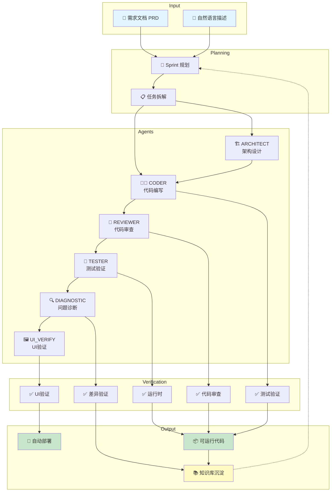

```mermaid
graph TB
    subgraph Input
        PRD[📝 需求文档 PRD]
        NL[💬 自然语言描述]
    end
    
    subgraph Planning
        PLAN[🎯 Sprint 规划]
        TASK[📋 任务拆解]
    end
    
    subgraph Agents
        CODER[👨‍💻 CODER<br/>代码编写]
        REVIEWER[👀 REVIEWER<br/>代码审查]
        ARCHITECT[🏗️ ARCHITECT<br/>架构设计]
        TESTER[🧪 TESTER<br/>测试验证]
        DIAG[🔍 DIAGNOSTIC<br/>问题诊断]
        UI[🖼️ UI_VERIFY<br/>UI验证]
    end
    
    subgraph Verification
        TEST[✅ 测试验证]
        REVIEW[✅ 代码审查]
        RUNTIME[✅ 运行时]
        UI_TEST[✅ UI验证]
        DIFF[✅ 差异验证]
    end
    
    subgraph Output
        CODE[📦 可运行代码]
        KB[📚 知识库沉淀]
        DEPLOY[🚀 自动部署]
    end
    
    PRD --> PLAN
    NL --> PLAN
    PLAN --> TASK
    TASK --> CODER
    TASK --> ARCHITECT
    
    CODER --> REVIEWER
    ARCHITECT --> CODER
    
    REVIEWER --> TESTER
    TESTER --> DIAG
    DIAG --> UI
    
    CODER --> TEST
    REVIEWER --> REVIEW
    TESTER --> RUNTIME
    UI --> UI_TEST
    DIAG --> DIFF
    
    TEST --> CODE
    REVIEW --> CODE
    RUNTIME --> CODE
    UI_TEST --> DEPLOY
    DIFF --> KB
    
    CODE --> KB
    KB -.-> PLAN
    
    style PRD fill:#e1f5fe
    style NL fill:#e1f5fe
    style CODE fill:#c8e6c9
    style DEPLOY fill:#c8e6c9
    style KB fill:#fff9c4
```
