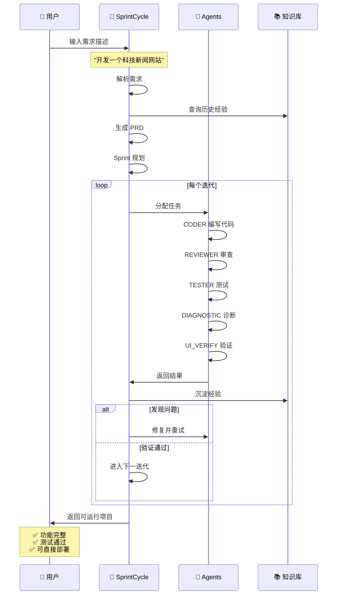

```mermaid
sequenceDiagram
    participant U as 👤 用户
    participant SC as 🔄 SprintCycle
    participant AG as 🤖 Agents
    participant KB as 📚 知识库
    
    U->>SC: 输入需求描述
    Note over SC: "开发一个科技新闻网站"
    
    SC->>SC: 解析需求
    SC->>KB: 查询历史经验
    
    SC->>SC: 生成 PRD
    SC->>SC: Sprint 规划
    
    loop 每个迭代
        SC->>AG: 分配任务
        AG->>AG: CODER 编写代码
        AG->>AG: REVIEWER 审查
        AG->>AG: TESTER 测试
        AG->>AG: DIAGNOSTIC 诊断
        AG->>AG: UI_VERIFY 验证
        
        AG->>SC: 返回结果
        SC->>KB: 沉淀经验
        
        alt 发现问题
            SC->>AG: 修复并重试
        else 验证通过
            SC->>SC: 进入下一迭代
        end
    end
    
    SC->>U: 返回可运行项目
    Note over U: ✅ 功能完整<br/>✅ 测试通过<br/>✅ 可直接部署
```
